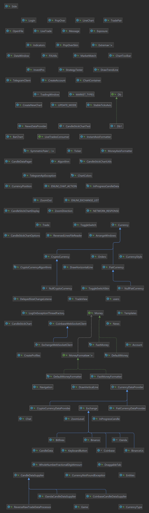
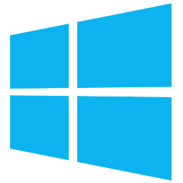

# Investpro


[](https://github.com/nguemechieu/actions/workflows/maven-publish.yml/badge.svg)
[](https://github.com/nguemechieu/actions/workflows/docker-image.yml)
[](https://opensource.org/licenses/Apache-2.0)
[](https://github.com/nguemechieu/investpro/actions/workflows/codecov.yaml)

# Welcome to InvestPro

## InvestPro is a powerful investment and utility software that offers a range of features for managing investments, trading, and accessing financial data. It supports platforms like BINANCE US, COINBASE PRO, OANDA, TELEGRAM BOT, FOREX NEWS FACTORY, and provides features such as portfolio management, trade alert, and trade signal.

To get started with InvestPro, follow these steps:

1.Build the Docker image using the command:
  docker build -t investpro .

The project is built using Maven, a popular build automation tool for Java projects. The source code is organized into
packages and modules within the java directory, and the build process is defined in the pom.xml file.

The project's structure includes a vast collection of images related to various cryptocurrencies in the images
directory, suggesting that the project might involve visualization or tracking of cryptocurrencies.

To contribute to InvestPro, you can start by exploring the source code in the java directory and the test cases in the
test directory. You can also refer to the pom.xml file to understand the project's dependencies and build process.

We hope this overview helps you get started with InvestPro. If you have any questions or need further assistance, please
don't hesitate to ask!

Noel M Nguemechieu at nguemechieu@live.com

# package org.investpro
What are the supported platforms and financial data sources for InvestPro, and how can I integrate new sources or
customize the existing ones to fit my specific needs?

InvestPro supports Windows, Linux, and macOS operating systems. It can connect to various financial data sources,
including:

* BINANCE US
* COINBASE PRO
* OANDA
* TELEGRAM BOT
* FOREX NEWS FACTORY

# What is the recommended setup process for building and running InvestPro, including any necessary dependencies and tools like Docker and Maven?

## Building and running InvestPro requires the following steps:

1.

Install Java Development Kit (JDK) version 11 or higher.

2.

Install Apache Maven version 3.6 or higher.

3.

Clone the InvestPro repository from GitHub.

4.

Open the project directory in a terminal or command prompt.

5.

Run the following command to compile and package the application:

mvn clean package

6. Run the following command to start the application:

java -jar target/investpro-1.0-SNAPSHOT.jar

This will start the application on port 8080.

Note: You may need to modify the port number if another application is already using port 8080.

InvestPro depends on several libraries and frameworks, including:

JavaFX for building the user interface
Spring for dependency injection and application configuration
Hibernate for object-relational mapping
Testcontainers for testing with Docker containers

In addition, you will need a valid API key for the financial data sources you wish to connect to.

# What are the key technologies and libraries used in InvestPro, and how do they contribute to the project's overall functionality and performance?

# InvestPro is a Java-based application that uses a number of key technologies and libraries to provide a robust and high-performance user experience. Some of the key technologies and libraries used in InvestPro include:

JavaFX: InvestPro uses JavaFX for building the user interface, which provides a rich and interactive experience for
users.
Spring: InvestPro uses Spring for dependency injection and application configuration, which makes it easier to maintain
and extend the application.
Hibernate: InvestPro uses Hibernate for object-relational mapping, which allows the application to store and retrieve
data in a relational database.
Testcontainers: InvestPro uses Testcontainers for testing with Docker containers, which allows for fast and reliable
testing of the application.
Apache Maven: InvestPro uses Apache Maven for building and managing the project's dependencies, making it easier to
maintain and update the application.

These technologies and libraries contribute to the project's overall functionality and performance by providing a solid
foundation for building and maintaining the application. They also provide a number of benefits, such as improved
maintainability, scalability, and testability.

Overall, the use of these key technologies and libraries in InvestPro helps to ensure that the application is reliable,
scalable, and easy to maintain and extend.
Include workspace code

# What else do you want to ask about this project?

What are the specific features and functionalities provided by InvestPro for managing investments and trading?
How do I contribute to the project, including the process for submitting pull requests and getting my changes reviewed
and merged?
Workspace indexing: Done
/document-code

Using workspace
InvestPro is a professional investment and utility software. It provides various features for managing investments,
trading, and accessing financial data.

- **License**: Apache 2.0
- **Author**: Nguemechieu Noel Martial
- **Date Created**: 2022-12-23

### Supported Features

- BINANCE US
- COINBASE
- OANDA
- TELEGRAM BOT
- FOREX NEWS FACTORY
- MINI WEB BROWSER
- SCREENSHOT
- PORTFOLIO MANAGEMENT
- Trade Alert
- Trade Signal

# UML DIAGRAMS

* Modules
* 
* Class
* 
* Java Modules
* 
### Operating Systems

- **WINDOWS** 
- **LINUX** 
- **MACOS** 

## Virtual Environment

### Docker

#### Configuration

Docker configuration file for the project.

#### Commands

**Build Command:**

```bash
docker build -t investpro .

