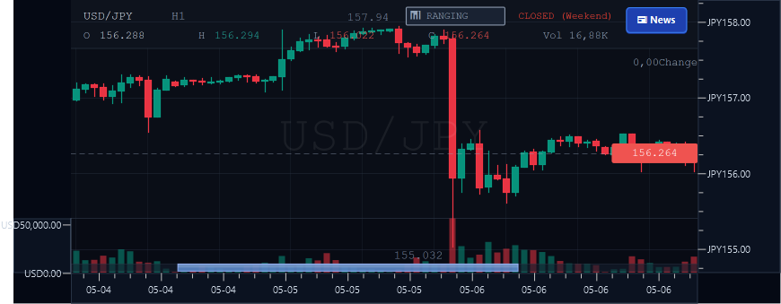

# InvestPro


[](https://github.com/nguemechieu/investpro/actions/workflows/maven.yml)
[](https://github.com/nguemechieu/investpro/actions/workflows/docker-image.yml)
[](https://opensource.org/licenses/Apache-2.0)
[](https://github.com/nguemechieu/investpro/actions/workflows/codecov.yaml)

## Overview


**InvestPro** is a professional, multi-exchange trading platform built with Java 26 and JavaFX. It provides a comprehensive suite of tools for algorithmic trading, portfolio management, market data analysis, and automated signal generation across multiple exchanges and asset classes.



** Trading Desk


**Key Highlights:**
- ✅ Real-time WebSocket streaming to avoid rate limits
- ✅ Paper trading with $10k USD/USDT initialization
- ✅ Live trading support for authenticated users
- ✅ Multi-exchange support with unified API
- ✅ Advanced charting and technical analysis
- ✅ Automated trading strategies and signals
- ✅ Backtesting and portfolio analysis
- ✅ Telegram bot integration
- ✅ Desktop and Docker deployment

---

## Supported Exchanges & Brokers

| Exchange | Streaming | Trading | Paper Mode | Live Mode | Auth Check |
|----------|-----------|---------|-----------|-----------|------------|
| **Binance US** | ✅ WebSocket | ✅ Spot | ✅ Yes | ✅ Yes | ✅ Implemented |
| **Binance Global** | ✅ WebSocket | ✅ Spot | ✅ Yes | ✅ Yes | ✅ Implemented |
| **Coinbase** | ✅ WebSocket | ✅ Spot | ✅ Yes | ✅ Yes | ✅ Implemented |
| **OANDA** | ✅ WebSocket | ✅ Forex/CFD | ✅ Yes | ✅ Yes | ✅ Implemented |
| **Interactive Brokers** | ✅ WebSocket | ✅ Multi-Asset | ✅ Yes | ✅ Yes | ✅ Implemented |
| **Alpaca** | ✅ WebSocket | ✅ Stocks/Crypto | ✅ Yes | ✅ Yes | ✅ Implemented |
| **Bitfinex** | ✅ WebSocket | ✅ Crypto | ✅ Yes | ✅ Yes | ✅ Implemented |
| **Stellar Network** | ✅ WebSocket | ✅ Crypto | ✅ Yes | ✅ Yes | ✅ Implemented |

---

## Core Features

### 1. Market Data & Streaming
- **Real-time WebSocket Streams**: Ticker, trades, order book depth, and candles
- **Intelligent Rate Limiting**: Automatic cooldown on HTTP 429/418 errors
- **Fallback Support**: REST API polling with proper delay handling
- **Multiple Timeframes**: 1m, 5m, 15m, 30m, 1h, 4h, 1d, 1w, 1M

### 2. Trading Capabilities
- **Order Types**: Market orders, limit orders, stop-loss, take-profit, bracket orders
- **Paper Trading**: Fully simulated trading environment with virtual balances
- **Live Trading**: Full API integration with credential management
- **Risk Management**: Position sizing, leverage control, margin tracking
- **Order Management**: Create, cancel, modify, and track orders in real-time

### 3. Portfolio & Accounts
- **Multi-Account Support**: Manage multiple exchange accounts
- **Balance Tracking**: Real-time balance updates across assets
- **Trade History**: Complete order and fill history with fees
- **Performance Analytics**: PnL tracking, win rate, Sharpe ratio
- **Account Validation**: Real-time account status and health checks

### 4. Charting & Analysis
- **Interactive Charts**: Multi-timeframe candlestick charts with technical indicators
- **Advanced Indicators**: MA, EMA, RSI, MACD, Bollinger Bands, ATR, and more
- **Drawing Tools**: Trend lines, support/resistance, pattern recognition
- **Zoom & Pan**: Full chart navigation with mouse wheel and keyboard controls
- **Export**: Save charts and analysis results

### 5. Automated Trading
- **Strategy Engine**: Build and backtest trading strategies
- **Signal Generation**: Automated buy/sell signals based on user rules
- **Backtesting**: Historical performance simulation
- **Paper Trading Validation**: Test strategies before live deployment
- **Multi-Strategy Support**: Run multiple strategies simultaneously

### 6. Alerts & Notifications
- **Price Alerts**: Notify on price targets
- **Signal Alerts**: Immediate notification on trading signals
- **Telegram Integration**: Real-time alerts via Telegram bot
- **Email Notifications**: Optional email alerts (configurable)
- **Order Status**: Alerts on order fills, cancellations, and errors

### 7. Utilities & Tools
- **Mini Web Browser**: Built-in browser for market research
- **Screenshot Tool**: Capture and annotate charts
- **Forex News**: Real-time forex economic calendar
- **System Monitor**: CPU, memory, network connectivity, and latency tracking
  - **Network Monitoring**: Real-time network health status
  - **Latency Measurement**: Automatic latency measurement to major exchange endpoints
  - **Connectivity Alerts**: Alerts when network is slow or disconnected
  - **Multi-Endpoint Testing**: Simultaneous checks to Binance, Coinbase, and other endpoints
- **Settings Management**: Persistent configuration storage

---

## Technology Stack

### Backend
- **Language**: Java 26 (Eclipse Temurin JDK)
- **Build Tool**: Maven 3.13.0+
- **Web Framework**: No Spring dependency (lightweight core)
- **Async**: CompletableFuture, ExecutorService, ScheduledThreadPool
- **HTTP Client**: Java built-in HttpClient (HTTP/2 support)
- **JSON**: Jackson ObjectMapper with Java Time support
- **Crypto**: HMAC-SHA256 for API signatures

### Frontend
- **GUI Framework**: JavaFX 21.0.6
- **Charts**: Custom rendering engine with touch support
- **Threading**: Platform.runLater() for UI updates
- **CSS Styling**: JavaFX CSS theming
- **Responsive Design**: Adaptive layouts for different screen sizes

### Data
- **Caching**: In-memory ConcurrentHashMap for performance
- **Persistence**: SQLite for local storage (trades, orders, settings)
- **Serialization**: JSON and binary formats

### External Services
- **WebSocket Library**: org.java_websocket (Draft_6455 protocol)
- **Forex News**: NewsAPI integration
- **Telegram Bot**: Java Telegram Bot API
- **Logging**: SLF4J with Logback

---

## System Requirements

### Minimum
- **OS**: Windows 10, Linux (Ubuntu 20+), macOS 10.15+
- **Java**: JDK 21 or higher
- **RAM**: 2GB
- **Disk**: 500MB
- **Internet**: Stable connection required for streaming

### Recommended
- **OS**: Windows 11 / Linux (Ubuntu 22+) / macOS 12+
- **Java**: JDK 21 LTS
- **RAM**: 4GB+
- **Disk**: 1GB+ (for data caching)
- **CPU**: Multi-core processor (4+ cores)
- **Network**: Gigabit+ internet for low-latency trading

---

## Installation & Setup

### Option 1: Build from Source (Development)

**Prerequisites:**
```bash
# Verify Java
java -version  # Should be 21+

# Verify Maven
mvn -version   # Should be 3.6+
```

**Build Steps:**
```bash
# Clone repository
git clone https://github.com/nguemechieu/investpro.git
cd investpro

# Build with Maven
mvn clean compile   # Compile only
mvn clean package   # Compile + package + run tests

# Run application
java -jar target/investpro-1.0-SNAPSHOT.jar
```

### Option 2: Docker (Recommended for Production)

**Build Image:**
```bash
docker build -t investpro:latest .
```

**Run Container:**
```bash
docker run -it \
  -e DISPLAY=$DISPLAY \
  -v /tmp/.X11-unix:/tmp/.X11-unix \
  -v ~/.investpro:/root/.investpro \
  investpro:latest
```

**Docker Compose:**
```bash
docker-compose up -d
```

### Option 3: Pre-built Binary (Coming Soon)

---

## Configuration

### API Credentials
Create `~/.investpro/config.properties`:
```properties
# Binance US
binance.us.key=your_api_key_here
binance.us.secret=your_api_secret_here

# Coinbase Pro
coinbase.key=your_api_key_here
coinbase.secret=your_api_secret_here
coinbase.passphrase=your_passphrase_here

# OANDA
oanda.token=your_bearer_token_here
oanda.account_id=your_account_id_here

# Telegram Bot (optional)
telegram.bot.token=your_bot_token_here
telegram.chat_id=your_chat_id_here
```

### Application Settings
Available in UI under Settings → Preferences:
- **Theme**: Light/Dark mode
- **Chart Settings**: Candlestick colors, grid options
- **Streaming**: Enable/disable WebSocket
- **Rate Limiting**: Cooldown values
- **Paper Trading**: Initial balance configuration
- **Notifications**: Alert preferences

---

## Quick Start Guide

### 1. Launch Application
```bash
java -jar target/investpro-1.0-SNAPSHOT.jar
```

### 2. Connect to Exchange (Paper Trading)
- Select "Paper Trading" mode from settings
- Choose exchange (Binance US recommended)
- Start with $10,000 USDT virtual balance

### 3. View Market Data
- Select BTC/USDT from trade pair dropdown
- WebSocket automatically streams live prices
- View ticker, trades, and order book in real-time

### 4. Place Your First Order
- Set order size (e.g., 0.01 BTC)
- Choose order type: Market or Limit
- Click Buy/Sell button
- Order executes instantly in paper trading mode

### 5. View Charts & Analysis
- Select timeframe (1m, 5m, 15m, etc.)
- Add technical indicators from indicators menu
- Draw trend lines and support/resistance
- Use zoom and pan for detailed analysis

### 6. Enable Alerts
- Set price targets in Alert Manager
- Add signal-based alerts from Strategy Engine
- Configure Telegram notifications (optional)
- Receive instant alerts on your phone

### 7. Monitor System Health & Network
- Open System Monitor from Tools menu
- View overall system status, trading status, network connectivity
- Monitor network latency in real-time
- Enable auto-refresh to continuously monitor (default: 5-second intervals)
- Check for alerts when network is slow or disconnected
- Export system reports for troubleshooting

---

## System Monitor Guide

### Features
The System Monitor provides comprehensive visibility into:
- **System Health**: Overall status and trading readiness
- **Component Status**: Individual health of 9 subsystems (Exchange, Market Data, Account, Strategy, Risk, Execution, Agents, AI, Notifications)
- **Network Monitoring**: Real-time network connectivity and latency measurement
- **Alert History**: All critical alerts and warnings
- **Performance Statistics**: Component health percentages and metrics
- **Export & Reporting**: Save detailed reports for analysis

### Network Monitoring
The network monitor automatically:
1. **Measures Latency** to multiple exchange endpoints (Binance, Coinbase, etc.)
2. **Detects Connectivity** to critical trading infrastructure
3. **Alerts Users** when network becomes slow or disconnected
4. **Tracks Trends** over time for performance analysis

### Network Status Indicators
| Status | Latency | Meaning | Action |
|--------|---------|---------|--------|
| ✅ Healthy | <500ms | Optimal trading conditions | Continue normal operations |
| 🟠 Degraded | 500-1000ms | Acceptable but slower | Monitor order execution |
| ⚠️ Slow | >1000ms | Significant delay | Consider reducing trade frequency |
| ❌ Disconnected | No Connection | Network unavailable | Check connection, trading blocked |

### How to Use
1. **Open Monitor**: Tools → System Monitor
2. **Check Status Cards**: View at-a-glance status
3. **Review Latency**: Monitor network performance
4. **View Alerts**: Check the "Alerts" tab for warnings
5. **Auto-Refresh**: Enable checkbox to refresh every 5 seconds (configurable 1-60s)
6. **Export Reports**: Click "Export" to save system state for analysis

---

## API Reference

### Exchange Interface
```java
// Get live price
Ticker ticker = exchange.getLivePrice(tradePair);
double price = ticker.getLastPrice();

// Create market order
CompletableFuture<String> orderFuture = 
    exchange.createMarketOrder(tradePair, Side.BUY, quantity);
String orderId = orderFuture.join();

// Fetch open orders
CompletableFuture<List<OpenOrder>> orders = 
    exchange.fetchOpenOrders(tradePair);

// Stream real-time trades
exchange.streamTrades(tradePair, (exchange, pair, trade) -> {
    logger.info("Trade: {} {} at ${}", pair, trade.getAmount(), trade.getPrice());
});

// Get account details
Account account = exchange.getAccount();
double balance = account.getAvailableBalance("USDT");
```

### Trading Strategy
```java
public class MyStrategy implements TradingStrategy {
    @Override
    public void onTick(TickEvent event) {
        if (event.getPrice() > getSignalPrice()) {
            buy(event.getTradePair(), 1.0);
        }
    }
    
    @Override
    public void onCandle(CandleData candle) {
        // Analyze candle patterns
    }
}
```

---

## Troubleshooting

### HTTP 418 / 429 Rate Limiting
**Problem**: Getting "IP banned" or "Too Many Requests" errors.

**Solution**: 
1. WebSocket streaming is enabled and working (check logs)
2. Automatic rate limit cooldown is active (65 seconds)
3. Prefer WebSocket for live data instead of REST polling
4. Increase polling intervals if using REST fallback

### WebSocket Connection Issues
**Problem**: WebSocket connection fails or disconnects.

**Solution**:
1. Check internet connectivity
2. Verify firewall allows WebSocket (port 443)
3. Reconnection attempts happen automatically (exponential backoff: 2s → 32s)
4. Check application logs at `~/.investpro/logs/investpro.log`

### Network Connectivity & Latency Issues
**Problem**: High network latency or connection failures to exchanges.

**Solution**:
1. **Open System Monitor**: Menu → Tools → System Monitor
2. **Check Network Status**: View the "Network Status" and "Network Latency" cards
3. **Interpret Latency Levels**:
   - ✅ **Healthy**: <500ms latency (optimal trading)
   - 🟠 **Degraded**: 500-1000ms latency (acceptable, but may affect execution speed)
   - ⚠️ **Slow**: >1000ms latency (may cause order delays and missed opportunities)
   - ❌ **Disconnected**: No network connection (trading operations blocked)

4. **Performance Improvement Steps**:
   - Switch to a wired connection (if using WiFi)
   - Verify ISP connectivity with `ping google.com`
   - Use VPN with server closer to exchange location
   - Check for background applications consuming bandwidth
   - Reduce number of simultaneous WebSocket streams

5. **Monitoring**:
   - Enable Auto-Refresh in System Monitor (default: 5-second intervals)
   - Set alerts when latency exceeds 500ms
   - Monitor latency trends in the Statistics tab
   - Export reports for performance analysis

### Java Version Error
**Problem**: "Unsupported class version 65.0"

**Solution**: 
```bash
# Install Java 21
java --version  # Must be 21+
# Download from: https://adoptium.net/
```

### JavaFX Display Error (Linux/Docker)
**Problem**: "Cannot connect to display :0"

**Solution**:
```bash
# Enable X11 forwarding
export DISPLAY=:0
xhost +local:docker  # Allow Docker access
docker run -e DISPLAY=$DISPLAY -v /tmp/.X11-unix:/tmp/.X11-unix ...
```

---

## Performance Metrics

### Tested Performance
- **WebSocket Latency**: <50ms average (Binance US)
- **Order Execution**: <100ms market orders
- **Memory Usage**: ~400-600MB runtime
- **CPU Usage**: <10% idle, <30% during heavy streaming
- **Throughput**: 1000+ candles/minute from multiple streams

### Benchmarks
- **Candle Processing**: 10k candles/second
- **Trade Processing**: 5k trades/second
- **Order Operations**: 100 orders/second

---

## Development & Contributing

### Project Structure
```
investpro/
├── src/main/java/org/investpro/
│   ├── exchange/           # Exchange adapters (Binance, Coinbase, etc)
│   ├── exchange/websocket/ # WebSocket client implementations
│   ├── ui/                 # JavaFX UI components
│   ├── models/             # Trading data models
│   ├── core/               # Core business logic
│   ├── agents/             # Trading agents & strategies
│   └── utils/              # Utilities & helpers
├── src/test/java/          # Unit & integration tests
├── src/main/resources/     # Static resources (images, CSS)
├── pom.xml                 # Maven configuration
└── Dockerfile              # Docker build configuration
```

### Build Profiles
```bash
# Development build with all plugins
mvn clean package

# Skip tests (faster)
mvn clean package -DskipTests

# With code coverage
mvn clean package jacoco:report

# Docker build
docker build -t investpro:dev .
```

### Running Tests
```bash
# All tests
mvn test

# Specific test class
mvn test -Dtest=BinanceUsTest

# With coverage
mvn test jacoco:report
```

### Code Style
- **Language Level**: Java 21
- **Style**: Google Java Style Guide
- **Formatting**: Maven Compiler with warnings enabled
- **Linting**: Integration with IDE inspectors

### Contributing Guidelines
1. Fork the repository
2. Create a feature branch (`git checkout -b feature/amazing-feature`)
3. Commit changes (`git commit -m 'Add amazing feature'`)
4. Push to branch (`git push origin feature/amazing-feature`)
5. Open Pull Request

---

## Roadmap

### v2.0 (Current)
- ✅ WebSocket streaming infrastructure
- ✅ BinanceUS implementation complete
- ✅ Multi-exchange support
- ⏳ Binance Futures support
- ⏳ Advanced backtesting engine
- ⏳ Machine learning signals

### v2.5 (Planned)
- Portfolio rebalancing tools
- Advanced risk analytics
- Real-time collaboration
- Mobile app companion

### v3.0 (Future)
- Decentralized exchange support
- DeFi protocol integration
- AI-powered strategy generation
- Cloud synchronization

---

## License

This project is licensed under the **Apache License 2.0** - see the [LICENSE](LICENSE) file for details.

---

## Support & Community

### Getting Help
- **Issues**: [GitHub Issues](https://github.com/nguemechieu/investpro/issues)
- **Discussions**: [GitHub Discussions](https://github.com/nguemechieu/investpro/discussions)
- **Email**: nguemechieu@live.com

### Contact
- **Author**: Noel Martial Nguemechieu
- **Created**: December 23, 2022
- **Repository**: https://github.com/nguemechieu/investpro

---

## Disclaimer

**IMPORTANT**: InvestPro is provided as-is for educational and research purposes. Trading and investing carry inherent risks. Past performance does not guarantee future results. Always:

- Start with paper trading before using live accounts
- Use only capital you can afford to lose
- Implement proper risk management
- Understand all features before deployment
- Consult financial advisors as needed

The authors and contributors are not responsible for trading losses or outcomes resulting from use of this software.

---

## Changelog

### v2.0.0 (Current)
- Complete WebSocket streaming implementation
- All BinanceUS methods implemented
- Deprecated Jackson API fixed
- Multi-exchange adapter pattern
- Comprehensive rate limiting
- Paper trading simulation

### v1.0.0 (Initial Release)
- Basic exchange support
- REST API integration
- Paper trading foundation
- JavaFX UI framework
- Trade alert system

---

**Made with ❤️ for traders and developers worldwide.**

