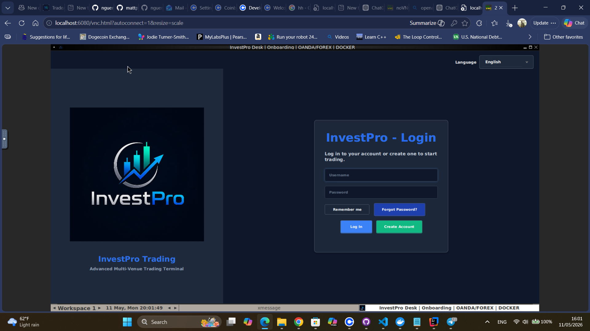

<p align="center">
  
</p>

<h1 align="center">InvestPro</h1>

<p align="center">
  <strong>Institutional-style, multi-asset trading workstation built with Java 21 + JavaFX.</strong><br/>
  Strategy engine · Agent runtime · AI-assisted analysis · Risk management · Backtesting · Paper trading · Multi-exchange execution
</p>

<p align="center">
  <a href="https://github.com/nguemechieu/investpro/actions/workflows/maven.yml">
    
  </a>
  <a href="https://github.com/nguemechieu/investpro/actions/workflows/docker-image.yml">
    
  </a>
  <a href="https://github.com/nguemechieu/investpro/actions/workflows/codecov.yaml">
    
  </a>
  <a href="https://opensource.org/licenses/Apache-2.0">
    
  </a>
  
  
  
</p>

---

## Table of Contents

- [Overview](#overview)
- [Project Status](#project-status)
- [Screenshots](#screenshots)
- [Why InvestPro?](#why-investpro)
- [Core Features](#core-features)
- [Architecture](#architecture)
- [Signal Execution Pipeline](#signal-execution-pipeline)
- [Supported Exchanges & Brokers](#supported-exchanges--brokers)
- [Installation](#installation)
- [Running the Application](#running-the-application)
- [Docker / Browser Desktop Mode](#docker--browser-desktop-mode)
- [Configuration](#configuration)
- [Quick Start](#quick-start)
- [Strategy Development](#strategy-development)
- [Risk Management Philosophy](#risk-management-philosophy)
- [System Monitoring](#system-monitoring)
- [Roadmap](#roadmap)
- [Contributing](#contributing)
- [Troubleshooting](#troubleshooting)
- [Disclaimer](#disclaimer)
- [License](#license)
- [Contact](#contact)

---

## Overview

**InvestPro** is an open-source desktop trading workstation for serious traders, developers, and researchers. It combines a native JavaFX trading terminal with exchange adapters, strategy execution, agent-based automation, AI-assisted reasoning, risk controls, paper trading, and deployment support through Docker/noVNC.

The goal is to provide a complete research-to-execution environment:

1. **Research** strategies using market data and technical indicators.
2. **Backtest** and forward-test strategy behavior.
3. **Paper trade** safely before using real funds.
4. **Monitor** system health, signals, risk, and execution flow.
5. **Execute** live trades only after passing multiple safety gates.

> **Important:** InvestPro does not guarantee profits. Trading and investing involve significant financial risk. Always validate strategies in paper trading before using real capital.

---

## Project Status

> 🚧 **Active Development** — Core systems are working, but the platform is still evolving. Some modules are experimental or still being stabilized. Paper trading is recommended before any live trading.

| Area | Status |
|---|---:|
| Java 21 + JavaFX desktop workstation | ✅ Working |
| Exchange adapters | ✅ Implemented |
| Real-time WebSocket streaming | ✅ Working |
| Strategy engine + signal pipeline | ✅ Working |
| Agent runtime / SmartBot | ✅ Working |
| Paper trading | ✅ Working |
| Live trading | ⚠️ Available, use carefully |
| Risk management layer | ✅ Working |
| AI reasoning integration | ✅ Working |
| Telegram alerts / commands | ✅ Working |
| Docker + noVNC desktop deployment | ✅ Working |
| StrategyLab backtesting | 🔄 In progress |
| Full automated test coverage | 🔄 In progress |
| Web/mobile companion UI | 📋 Planned |

---

## Screenshots

| Trading Desk | Market Watch + Signals |
|---|---|
|  |  |

> Screenshots reflect a development build. UI and layouts may continue to change.

### Docker VNC Access

Access the full desktop from a browser:

```text
http://localhost:6080/vnc.html?autoconnect=1&resize=scale
```



---

## Why InvestPro?

Many open-source trading systems are either pure algorithmic frameworks with no serious UI, or simple single-exchange bots with limited risk control. InvestPro is designed to bridge that gap.

InvestPro provides:

- **Desktop-first trading workstation** with charts, market watch, orders, signals, and portfolio views.
- **Multi-exchange architecture** so strategies can run across different brokers and venues.
- **Strategy-first design** where trading logic is modular, testable, and replaceable.
- **Agent runtime** for symbol-level automation and system orchestration.
- **Risk-first execution** so signals are reviewed before orders reach the market.
- **Paper trading by default** to validate behavior before live execution.
- **AI-assisted reasoning** as an optional review layer, never as a direct executor.
- **Docker/noVNC deployment** for browser-based access to the desktop app.

---

## Core Features

### Market Data & Streaming

- Real-time WebSocket feeds for ticker, trades, order book depth, and candles.
- Multi-timeframe support: `1m`, `5m`, `15m`, `30m`, `1h`, `4h`, `1d`, `1w`, `1M`.
- REST fallback when WebSocket data is unavailable.
- Rate-limit handling for HTTP `429` and exchange ban/cooldown responses.
- Exchange capability probing to determine what each venue supports.

### Trading Capabilities

- Paper trading with configurable virtual balance.
- Live trading through authenticated exchange APIs.
- Market, limit, stop-loss, take-profit, and bracket-style order support where available.
- Order lifecycle management: create, cancel, track fills, and review status.
- Small-account mode for conservative sizing.
- Symbol cooldown logic to reduce open/close thrashing.

### Symbol Tradability Controls

- InvestPro uses `UniversalTradabilityService` to normalize per-symbol permissions across exchanges and brokers.
- Market watch and research views can include symbols where `marketDataAllowed=true`.
- Bot symbol selection is restricted to `botTradingAllowed=true` symbols.
- Live order submission performs an immediate recheck requiring `orderSubmissionAllowed=true` before sending an order.
- Backtesting accepts symbols with `marketDataAllowed=true`, even when live trading is disabled for that symbol.
- Tradability metadata is surfaced in UI filters and columns so restrictions are visible before execution.

### Strategy Engine

- Pluggable `TradingStrategy` interface.
- `StrategyEngine` for running multiple strategies per symbol.
- `StrategyCatalog` for built-in strategies.
- `StrategyBootstrapper` for default strategy initialization.
- `StrategyLab` for backtesting and forward testing.
- Signal classification, filtering, scoring, and safety review.

### Agent Runtime

- `AgentRuntime` manages trading agent lifecycle.
- `AgentEventBus` decouples system components through events.
- `SymbolAgent` evaluates market state per symbol (in `symbol/` package) — collects 50 ticks before triggering real-candle backtesting.
- `SymbolAgentManager` controls active symbol agents and state (thread-safe `ConcurrentHashMap`).
- `SymbolAgentUpdater` bridges exchange tick events → `SymbolAgentManager` bid/ask/spread/signal state for the MarketWatch panel.
- `MarketWatchPanel` polls `SymbolAgentManager.getAllStates()` every 3 seconds and calls `MarketWatchRow.updateSymbolState()` on every row at each refresh cycle — live bid/ask/spread data always flows.
- `PortfolioAgent` manages capital allocation and exposure (in `portfolio/` package).
- Auto-trading starts **OFF** by default and must be explicitly enabled.

### Risk Management

- `RiskManagementSystem` reviews every trade candidate.
- Configurable max risk per trade.
- Configurable max daily loss.
- Small-account mode.
- Portfolio heat / exposure checks.
- Execution gate before live orders.
- AI reasoning gate when enabled.

### AI-Assisted Analysis

- `AiReasoningService` interface for pluggable AI providers (in `ai/` package).
- `OpenAiReasoningService` for optional GPT-assisted trade review.
- `LocalAiReasoningService` fallback for offline operation.
- `ReasoningAgent` in `reasoning/` for structured decision reasoning.
- `AiAuditLogger` records AI decisions for auditability.
- AI can approve, reject, or explain signals.
- AI **does not execute trades directly**.

### Charting & Technical Analysis

- Interactive candlestick charts.
- Multi-timeframe analysis.
- Rich `indicators/` package: MA, EMA, RSI, MACD, Bollinger Bands, ATR, ADX, CCI, VWAP, Ichimoku, Stochastic, OBV, Parabolic SAR, Zigzag, Fibonacci, and more.
- Zoom and pan support.
- Support/resistance and annotation-ready chart structure.

### Notifications

- Telegram bot integration.
- Telegram commands such as `/status` and `/setapikey` when enabled.
- Email notifications through SMTP.
- Signal monitoring logs for every stage of the signal pipeline.
- See [USER_GUIDE.md](USER_GUIDE.md) for SMTP setup, app passwords, and troubleshooting.

### Deployment

- Native JavaFX desktop app.
- Docker image with JavaFX, Xvfb, Fluxbox, x11vnc, and noVNC.
- Browser access to the desktop UI.
- PostgreSQL support for production-style deployments.
- SQLite support for local development and event logs.
- Plugin architecture via Java `ServiceLoader` SPI for extensions (exchanges, strategies, indicators, risk modules).

---

## Architecture

```text
┌─────────────────────────────────────────────────────────────────┐
│                         JavaFX UI Layer                         │
│  TradingDesk · MarketWatchPanel · ChartPanel · OrderPanel       │
└────────────────────────────┬────────────────────────────────────┘
                             │
┌────────────────────────────▼────────────────────────────────────┐
│                          SystemCore                             │
│  Application composition root — wires all major services         │
│  EventBusManager · SignalMonitorService · SystemMonitorService  │
└──────┬──────────┬──────────┬──────────┬──────────┬─────────────┘
       │          │          │          │          │
┌──────▼─────┐ ┌──▼──────┐ ┌─▼───────┐ ┌▼────────┐ ┌▼────────────┐
│ SmartBot   │ │Strategy │ │ Risk    │ │ AI      │ │ Exchange    │
│ Agent      │ │Engine   │ │ System  │ │Reasoning│ │ Adapters    │
│ Runtime    │ │         │ │         │ │         │ │             │
└──────┬─────┘ └──┬──────┘ └─┬───────┘ └┬────────┘ └┬────────────┘
       │          │          │          │           │
       └──────────▼──────────▼──────────▼───────────┘
                  TradeExecutionCoordinator
        Signal → Decision → Risk → AI Review → Execution
```

### Package Layout

```text
src/main/java/org/investpro/
├── ai/                     # AI trade review interface, OpenAI/local providers, audit logging
│   ├── learning/           # Machine learning helpers
│   └── ml/                 # ML model integration
├── backtesting/            # BacktestingService, BacktestConfig, BacktestResult, simulators
├── config/                 # Application and environment configuration
├── core/                   # SystemCore, notification services, Telegram handlers
│   ├── agents/             # AgentRuntime, AgentEventBus, Agent, AgentRegistry
│   ├── bot/                # SmartBot controller
│   ├── controller/         # Application controllers
│   ├── execution/          # ExecutionEngine, TradeExecutionCoordinator
│   └── pipeline/           # TradeDecisionPipeline, risk context builders
├── credential/             # API credential management
├── data/                   # CandleData and local data helpers
├── decision/               # Institutional decision pipeline (see below)
├── dependency/             # Dependency wiring utilities
├── enums/                  # Application-wide enumerations
├── event/                  # EventBusManager, event persistence
├── exchange/               # Exchange adapters (Binance, Coinbase, OANDA, Alpaca, IB, etc.)
├── i18n/                   # Internationalization and translations
├── indicators/             # Technical indicators: MA, EMA, RSI, MACD, Bollinger, ATR, etc.
├── licensing/              # License management
├── market/                 # Market data models and services
├── models/                 # TradePair, Order, Account, Ticker, Trade
├── monitoring/             # SystemMonitorService, SignalMonitorService
├── operations/             # Operational support utilities
├── persistence/            # SQLite/PostgreSQL repositories and event log persistence
├── portfolio/              # PortfolioAgent, capital allocator, exposure and heat management
├── reasoning/              # OpenAIReasoningClient, ReasoningAgent, ReasoningDecision
├── research/               # Market research helpers
├── risk/                   # RiskManagementSystem and risk decisions
├── service/                # Domain services: OrderService, TradeService, CurrencyService, etc.
├── signal/                 # Signal, SignalAgent
├── spi/                    # Service provider interfaces for plugins
├── strategy/               # StrategyEngine, StrategyCatalog, StrategyLab, user strategies
├── symbol/                 # SymbolAgent, SymbolAgentManager, SymbolAgentUpdater, symbol state
├── trading/                # PreTradeValidation, pre-trade checklist
│   └── tradability/        # Universal symbol tradability model and filters
├── ui/                     # JavaFX windows, panels, charts, controls
└── utils/                  # Shared utility classes
```

#### `decision/` package — Institutional Decision Pipeline

```text
decision/
├── TradeIntent.java                # Market opportunity + desired exposure
├── PortfolioImpact.java            # Exposure, concentration, correlation analysis
├── RiskEvaluation.java             # Full risk check with APPROVED/REDUCED/REJECTED/WAIT verdict
├── PositionSizingDecision.java     # Fixed-risk / ATR / Kelly / volatility sizing
├── DecisionReasoning.java          # AI model confidence, veto chain, reasoning summary
├── ExecutionPlan.java              # Entry, stop-loss, take-profit, leverage, time-in-force
├── ExecutionRoute.java             # Venue routing with slippage, fee, latency estimates
├── ExecutionDecision.java          # Approved/rejected outcome with lifecycle
├── InstitutionalExecutionDecision  # Top-level immutable composition record
├── DecisionPipelineOrchestrator    # 9-phase pipeline coordinator
├── BotTradeDecisionAssembler       # Bridges pipeline → legacy BotTradeDecision adapter
├── BotTradeDecision.java           # Legacy-compat adapter (immutable, 5 constructors)
├── DecisionContext.java            # Typed metadata (exchange, timeframe, session, spread…)
├── DecisionScoreBreakdown.java     # Per-dimension scoring (trend, vol, liquidity, AI, risk…)
├── DecisionSnapshot.java           # Compact FULL/LIGHTWEIGHT/REPLAY/ARCHIVE serialization
├── DecisionIdGenerator.java        # AtomicLong IDs for simulation; UUID for live
├── DecisionStatus.java             # Lifecycle enum: CREATED → EXECUTED / FAILED / EXPIRED
├── DecisionMode.java               # LIVE / PAPER / SIMULATION / LIGHTWEIGHT
├── ExecutionVenueType.java         # CENTRALIZED_EXCHANGE / BROKER / DEX / BLOCKCHAIN / …
├── ExecutionLifecycle.java         # Full lifecycle timestamp tracking
├── DecisionPerformanceMetrics.java # Nanosecond phase timing
├── BlockchainExecutionContext.java # On-chain context (Solana, Stellar, EVM)
├── ExecutionRouter.java            # @FunctionalInterface with simulated()/direct() defaults
├── LiquidityAnalyzer.java          # @FunctionalInterface for liquidity estimation
└── VenueScorer.java                # @FunctionalInterface for venue quality scoring
```

---

## Signal Execution Pipeline

InvestPro is designed so that a raw strategy signal cannot directly place a trade. Every signal must pass through a controlled pipeline.

```text
Market Signal
  └─→ TradeIntent          (desired direction + exposure)
        └─→ PortfolioImpact (exposure, concentration, correlation)
              └─→ RiskEvaluation (APPROVED / REDUCED / REJECTED / WAIT)
                    └─→ PositionSizingDecision (fixed-risk, ATR, Kelly, volatility)
                          └─→ DecisionReasoning (AI model confidence + veto chain)
                                └─→ ExecutionPlan (entry, stop, take-profit, sizing)
                                      └─→ ExecutionRoute (venue, slippage, fee, latency)
                                            └─→ InstitutionalExecutionDecision
                                                  └─→ ExecutionEngine → Exchange API
```

### Decision Pipeline Classes (`decision/` package)

| Class | Role |
|---|---|
| `TradeIntent` | Market opportunity + desired exposure, no execution info |
| `PortfolioImpact` | Exposure increase, concentration, correlation, hedge effect |
| `RiskEvaluation` | Full risk check → `APPROVED / REDUCED / REJECTED / WAIT` |
| `PositionSizingDecision` | Fixed-risk, ATR, Kelly, volatility, or drawdown-scaled sizing |
| `DecisionReasoning` | AI model confidence, veto reason, reasoning chain |
| `ExecutionPlan` | Entry, stop-loss, take-profit, leverage, time-in-force |
| `ExecutionRoute` | Venue routing with slippage, fee, latency, and quality score |
| `ExecutionDecision` | Approved / rejected outcome with lifecycle tracking |
| `InstitutionalExecutionDecision` | Top-level immutable composition of all phases |
| `DecisionSnapshot` | Compact serializable snapshot for replay / audit |
| `DecisionIdGenerator` | Atomic-long IDs for simulation; UUID for live |
| `DecisionPipelineOrchestrator` | 9-phase pipeline coordinator |
| `BotTradeDecisionAssembler` | Bridges new pipeline → legacy `BotTradeDecision` adapter |

### Decision Lifecycle

```text
CREATED → VALIDATED → RISK_REJECTED / AI_REJECTED
       → EXECUTION_PENDING → EXECUTED / FAILED / CANCELLED / EXPIRED
```

### Execution Venue Routing

| Venue | Type |
|---|---|
| Binance, Coinbase | CENTRALIZED_EXCHANGE |
| OANDA, Interactive Brokers | BROKER |
| Stellar, Solana (future) | BLOCKCHAIN / DEX |
| Strategy Lab | SIMULATED |
| Paper mode | PAPER |

### Simulation Optimizations

- `DecisionMode.LIGHTWEIGHT` skips UUID allocation, metadata maps, and heavy reasoning storage.
- `DecisionMode.SIMULATION` uses atomic-long sequence IDs instead of `UUID.randomUUID()`.
- `ExecutionPlan.EMPTY`, `PortfolioImpact.NEUTRAL`, `DecisionReasoning.NONE` are null-object constants that avoid deep nullable chains.
- `double confidenceValue` replaces `BigDecimal confidence` for scoring (BigDecimal retained only for money and fees).

### Execution Safety Gates

| Gate | Purpose |
|---|---|
| `SignalToDecisionFilter` | Converts raw signals into reviewed trade candidates |
| `BotTradeDecisionEngine` | Scores the trade idea and decides whether it deserves review |
| `RiskEvaluation` | Enforces risk limits, exposure, sizing, and daily loss controls |
| `DecisionReasoning` | Optional AI second-review layer for reasoning and explanation |
| `TradeExecutionCoordinator` | Final authority before any order reaches the exchange |
| `ExecutionEngine` | Places, tracks, and manages orders |

---

## Supported Exchanges & Brokers

| Venue | Asset Classes | WebSocket | Paper | Live |
|---|---|---:|---:|---:|
| Binance Global | Crypto spot | ✅ | ✅ | ✅ |
| Binance US | Crypto spot | ✅ | ✅ | ✅ |
| Coinbase | Crypto spot | ✅ | ✅ | ✅ |
| OANDA | Forex, CFD | ✅ | ✅ | ✅ |
| Interactive Brokers | Stocks, futures, forex, options | ✅ | ✅ | ✅ |
| Alpaca | US stocks, crypto | ✅ | ✅ | ✅ |
| Bitfinex | Crypto | ✅ | ✅ | ✅ |
| Stellar Network | XLM / USDC DEX | ✅ | ✅ | ✅ |

> Live trading requires valid API credentials. Always test with paper trading first.

---

## Installation

### Requirements

| Requirement | Version |
|---|---:|
| Java JDK | 21 LTS |
| JavaFX | 21.0.6 |
| Maven | 3.6+ |
| Git | Recent version |
| Docker | Optional, 20+ recommended |

Recommended JDK: **Eclipse Temurin 21**.

Check your local environment:

```bash
java -version
mvn -version
```

Java must show version `21` or newer.

---

## Running the Application

### Clone the Repository

```bash
git clone https://github.com/nguemechieu/investpro.git
cd investpro
```

### Build

```bash
mvn clean package -DskipTests
```

### Recommended Development Run Command

Use the JavaFX Maven plugin:

```bash
mvn javafx:run
```

This is the safest way to run the app during development because JavaFX is not bundled inside Java 21.

> Do **not** rely on plain `java -jar` during development unless JavaFX modules are provided manually.

### Manual JAR Run With JavaFX Modules

If you want to run the built JAR directly, you must provide the JavaFX module path.

#### Windows

```bash
java ^
  --module-path "C:\path\to\javafx-sdk-21.0.6\lib" ^
  --add-modules javafx.controls,javafx.fxml,javafx.graphics,javafx.web,javafx.swing ^
  -jar target/investpro-1.0.0-SNAPSHOT.jar
```

#### Linux

```bash
java \
  --module-path /usr/share/openjfx/lib \
  --add-modules javafx.controls,javafx.fxml,javafx.graphics,javafx.web,javafx.swing \
  -jar target/investpro-1.0.0-SNAPSHOT.jar
```

### Recommended Production Packaging

For production releases, use `jlink` or `jpackage` so users do not need to install JavaFX separately.

Recommended production targets:

- Windows `.exe` installer
- Linux `.deb` / `.rpm` package
- macOS `.dmg` bundle
- Docker/noVNC remote desktop image

---

## Required Maven JavaFX Setup

Make sure your `pom.xml` contains JavaFX dependencies and the JavaFX Maven plugin.

```xml
<properties>
    <java.version>21</java.version>
    <javafx.version>21.0.6</javafx.version>
</properties>

<dependencies>
    <dependency>
        <groupId>org.openjfx</groupId>
        <artifactId>javafx-controls</artifactId>
        <version>${javafx.version}</version>
    </dependency>

    <dependency>
        <groupId>org.openjfx</groupId>
        <artifactId>javafx-fxml</artifactId>
        <version>${javafx.version}</version>
    </dependency>

    <dependency>
        <groupId>org.openjfx</groupId>
        <artifactId>javafx-web</artifactId>
        <version>${javafx.version}</version>
    </dependency>

    <dependency>
        <groupId>org.openjfx</groupId>
        <artifactId>javafx-swing</artifactId>
        <version>${javafx.version}</version>
    </dependency>
</dependencies>
```

```xml
<build>
    <plugins>
        <plugin>
            <groupId>org.openjfx</groupId>
            <artifactId>javafx-maven-plugin</artifactId>
            <version>0.0.8</version>
            <configuration>
                <mainClass>org.investpro.Main</mainClass>
            </configuration>
        </plugin>
    </plugins>
</build>
```

Replace `org.investpro.Main` with your actual JavaFX launcher class.

---

## Docker / Browser Desktop Mode

InvestPro can run in Docker with a browser-accessible Linux desktop using Xvfb, Fluxbox, x11vnc, and noVNC.

### Start With Docker Compose

```bash
docker-compose up -d
```

Open the desktop in your browser:

```text
http://localhost:6080/vnc.html?autoconnect=1&resize=scale
```

Or connect with a native VNC client:

```text
localhost:5900
```

Default VNC password:

```text
investpro
```

### Exposed Ports

| Port | Service |
|---:|---|
| `6080` | noVNC web client |
| `5900` | Native VNC |
| `8080` | Application HTTP / future REST API |
| `5432` | PostgreSQL |

### Docker JavaFX Runtime Notes

Docker images that run JavaFX must include JavaFX modules and native GUI libraries. A typical Debian/Ubuntu runtime needs packages such as:

```dockerfile
RUN apt-get update && apt-get install -y --no-install-recommends \
    openjfx \
    xvfb \
    x11vnc \
    novnc \
    websockify \
    fluxbox \
    supervisor \
    libgtk-3-0 \
    libxtst6 \
    libxrender1 \
    libxi6 \
    libxext6 \
    libgl1 \
    libasound2t64 \
    && rm -rf /var/lib/apt/lists/*
```

A Docker JavaFX run command should include:

```bash
java \
  --module-path /usr/share/openjfx/lib \
  --add-modules javafx.controls,javafx.fxml,javafx.graphics,javafx.web,javafx.swing \
  -jar /app/investpro.jar
```

---

## Configuration

Create a local configuration file:

```text
~/.investpro/config.properties
```

Example:

```properties
# --- Binance US ---
binance.us.key=YOUR_API_KEY
binance.us.secret=YOUR_API_SECRET

# --- Binance Global ---
binance.key=YOUR_API_KEY
binance.secret=YOUR_API_SECRET

# --- Coinbase ---
coinbase.key=YOUR_API_KEY
coinbase.secret=YOUR_API_SECRET

# --- OANDA ---
oanda.token=YOUR_BEARER_TOKEN
oanda.account_id=YOUR_ACCOUNT_ID

# --- Alpaca ---
alpaca.key=YOUR_API_KEY
alpaca.secret=YOUR_API_SECRET

# --- Telegram Bot optional ---
telegram_token=YOUR_BOT_TOKEN

# --- Email notifications optional ---
from_email=you@example.com
to_email=alerts@example.com
EMAIL_NOTIFICATIONS_ENABLED=false
EMAIL_SMTP_HOST=smtp.gmail.com
EMAIL_SMTP_PORT=587
EMAIL_SMTP_USERNAME=you@example.com
EMAIL_SMTP_PASSWORD=YOUR_APP_PASSWORD
EMAIL_SMTP_STARTTLS=true
EMAIL_FROM=you@example.com
EMAIL_TO=alerts@example.com

# --- OpenAI optional ---
openai.api_key=YOUR_OPENAI_KEY

# --- Risk limits ---
risk.small_account.enabled=true
risk.small_account.threshold=100.0
risk.small_account.oanda_units=1.0
risk.max_risk_per_trade=0.01
risk.max_daily_loss=0.03
```

> **Security:** Never commit API keys, tokens, passwords, or account IDs to Git.

The OpenAI API key may also be provided with:

```bash
export OPENAI_API_KEY="YOUR_OPENAI_KEY"
```

On Windows PowerShell:

```powershell
$env:OPENAI_API_KEY="YOUR_OPENAI_KEY"
```

---

## Quick Start

### 1. Launch InvestPro

```bash
mvn javafx:run
```

### 2. Start With Paper Trading

1. Select an exchange, such as **Binance US**, **Coinbase**, or **OANDA**.
2. Enable **Paper Trading** mode.
3. Confirm that a virtual balance is loaded.
4. Select a symbol from Market Watch.

### 3. View Live Market Data

- Select a trade pair such as `BTC/USDT`, `ETH/USD`, or `EUR/USD`.
- Confirm ticker, trades, order book, and chart updates.
- Prefer WebSocket mode for live streaming.

### 4. Place a Paper Order

- Select order side: **Buy** or **Sell**.
- Choose order type.
- Set quantity.
- Submit the order.
- Review result in orders/trades history.

### 5. Enable a Strategy

- Open the strategy panel.
- Choose a built-in strategy.
- Assign it to a symbol and timeframe.
- Review generated signals.
- Keep auto-trading disabled until the strategy has enough paper-trading history.

### 6. Monitor the System

Open the system monitor to review:

- Exchange connection status
- WebSocket health
- Market data status
- Strategy signals
- Risk decisions
- AI reasoning results
- Execution events
- Notification status

---

## Strategy Development

InvestPro is designed so users can create their own strategies.

Example strategy skeleton:

```java
package org.investpro.strategy.user;

import org.investpro.data.CandleData;
import org.investpro.strategy.StrategyContext;
import org.investpro.strategy.StrategySignal;
import org.investpro.strategy.TradingStrategy;

public class MyMomentumStrategy implements TradingStrategy {

    @Override
    public String getName() {
        return "MyMomentumStrategy";
    }

    @Override
    public StrategySignal evaluate(StrategyContext context) {
        CandleData latest = context.getLatestCandle();

        if (latest == null) {
            return StrategySignal.NEUTRAL;
        }

        double close = latest.getClose();
        double open = latest.getOpen();

        if (close > open * 1.005) {
            return StrategySignal.buySignal(context.getTradePair(), close);
        }

        if (close < open * 0.995) {
            return StrategySignal.sellSignal(context.getTradePair(), close);
        }

        return StrategySignal.NEUTRAL;
    }
}
```

Register the strategy in your strategy bootstrap or registry:

```java
StrategyRegistry.register(new MyMomentumStrategy());
```

### Strategy Requirements

A production-quality strategy should define:

- Name and version.
- Supported asset classes.
- Supported venues.
- Supported timeframes.
- Required indicators.
- Warmup candle count.
- Risk assumptions.
- Entry logic.
- Exit logic.
- Stop-loss logic.
- Take-profit logic.
- Backtest requirements.
- Paper-trading validation rules.

### Suggested Minimum Strategy Validation

Before assigning a strategy to auto-trading:

| Metric | Suggested Minimum |
|---|---:|
| Backtest trades | 100+ preferred |
| Paper trading period | 2–4 weeks minimum |
| Profit factor | 1.3+ preferred |
| Max drawdown | Must fit account risk limits |
| Win rate | Context dependent |
| Average reward/risk | Greater than 1.0 preferred |
| Live/paper slippage | Must be measured |

> A strategy with a high win rate can still lose money if average losses are larger than average wins.

---

## Risk Management Philosophy

InvestPro is built around one core principle:

> **No signal should reach the market unchecked.**

The system should reject trades when:

- The account risk is too high.
- The daily loss limit is reached.
- The strategy has insufficient validation.
- The market is too volatile for the strategy.
- The spread or slippage is unacceptable.
- The venue does not support the required order type.
- The bot is in cooldown mode.
- Auto-trading is disabled.
- The AI/risk review rejects the trade.

### Risk Controls

| Control | Description |
|---|---|
| Max risk per trade | Limits capital exposed per trade. |
| Max daily loss | Stops trading after daily drawdown threshold. |
| Small-account mode | Reduces sizing for small balances. |
| Portfolio heat | Prevents too much total exposure. |
| Symbol cooldown | Prevents rapid open/close loops. |
| Strategy validation | Blocks untested strategies from live use. |
| Execution review | Verifies order type, size, venue, and risk. |

---

## System Monitoring

InvestPro includes monitoring services for operational visibility.

### SystemMonitorService

Tracks major subsystems:

1. Exchange connectivity
2. Market data
3. Account state
4. Strategy engine
5. Risk management
6. Execution engine
7. Agent runtime
8. AI reasoning
9. Notifications

### SignalMonitorService

Tracks signal lifecycle:

```text
Signal created
  → Signal filtered
  → Decision generated
  → Risk reviewed
  → AI reviewed
  → Execution approved/rejected
  → Order submitted
  → Fill/cancel/error recorded
```

### Event Logging

Important system events are persisted for review and debugging. Logs should help answer:

- What signal was generated?
- Which strategy generated it?
- Why was it approved or rejected?
- What did the risk engine decide?
- What did the AI review say?
- Was an order submitted?
- Did the exchange accept or reject the order?

---

## Roadmap

### v1.0 — Current Active Development

- [x] Java 21 + JavaFX trading workstation
- [x] Multi-exchange adapter structure
- [x] WebSocket-first market data streaming
- [x] Strategy engine
- [x] Agent runtime
- [x] Risk management system
- [x] Paper trading
- [x] AI reasoning integration
- [x] Telegram integration
- [x] Docker/noVNC deployment
- [x] Institutional decision pipeline (`decision/` package — 9-phase orchestrator)
- [x] Immutable domain model for all decision objects
- [x] Execution routing framework (CENTRALIZED_EXCHANGE / BROKER / DEX / BLOCKCHAIN)
- [x] Position sizing engine (fixed-risk, ATR, Kelly, volatility, drawdown-scaled)
- [x] MarketWatch real-time bid/ask/spread live data flow
- [x] Lightweight simulation mode (no UUID allocation, minimal heap pressure)
- [ ] StrategyLab stabilization
- [ ] Better automated tests
- [ ] Production installer packaging

### v1.5 — Planned

- [ ] Advanced backtesting
- [ ] Walk-forward testing
- [ ] Monte Carlo testing
- [ ] Strategy ranking and auto-assignment
- [ ] Portfolio-level analytics
- [ ] Sharpe, Sortino, max drawdown dashboard
- [ ] User strategy builder UI
- [ ] Improved execution simulator

### v2.0 — Future

- [ ] REST API server for remote control
- [ ] investpro.org web companion
- [ ] Cloud sync
- [ ] Multi-machine agent coordination
- [ ] Mobile companion app
- [ ] Advanced AI strategy assistant
- [ ] Plugin marketplace for user strategies
- [ ] Solana on-chain execution routing
- [ ] Stellar network DEX integration
- [ ] Smart order routing across venues
- [ ] Distributed Strategy Lab workers
- [ ] Event-sourced audit replay engine

---

## Contributing

Contributions are welcome.

### Workflow

1. Fork the repository.
2. Create a feature branch:

```bash
git checkout -b feature/your-feature-name
```

3. Make your changes.
4. Add or update tests.
5. Run the build:

```bash
mvn clean package
```

6. Open a pull request with a clear description.

### Code Standards

- Java 21.
- Maven build.
- JavaFX UI conventions.
- SLF4J/Logback for logging.
- No `System.out.println` in production code.
- JetBrains `@NotNull` / `@Nullable` annotations where useful.
- Null-safe code.
- Clear error handling.
- Tests for important business logic.

### Good Pull Requests Include

- What changed.
- Why it changed.
- How it was tested.
- Screenshots for UI changes.
- Logs for runtime fixes.
- Migration notes if configuration changed.

---

## Troubleshooting

### Error: JavaFX runtime components are missing

This usually happens when running the app with plain `java -jar` without JavaFX modules.

Use this during development:

```bash
mvn clean javafx:run
```

Or run manually with JavaFX modules:

```bash
java \
  --module-path /path/to/javafx-sdk-21.0.6/lib \
  --add-modules javafx.controls,javafx.fxml,javafx.graphics,javafx.web,javafx.swing \
  -jar target/investpro-1.0.0-SNAPSHOT.jar
```

### Unsupported class version error

Your Java version is too old.

```bash
java -version
```

Install Java 21 or newer.

### Maven cannot find JavaFX plugin

Make sure your `pom.xml` contains:

```xml
<plugin>
    <groupId>org.openjfx</groupId>
    <artifactId>javafx-maven-plugin</artifactId>
    <version>0.0.8</version>
</plugin>
```

Then run:

```bash
mvn clean javafx:run
```

### JavaFX display error on Linux

Check your display environment:

```bash
echo $DISPLAY
```

For local Linux desktop usage, you may need:

```bash
export DISPLAY=:0
```

For Docker, use the provided noVNC setup instead of trying to attach directly to the host display.

### Docker VNC screen is blank

Try:

```bash
docker-compose logs -f
```

Check that these services started correctly:

- Xvfb
- Fluxbox
- x11vnc
- noVNC / websockify
- Java application

### WebSocket disconnects

- Reconnection should happen automatically.
- Check exchange rate limits.
- Verify firewall and network access.
- Prefer WebSocket streaming over REST polling.
- Check logs in `~/.investpro/logs/`.

### HTTP 429 / 418 rate limits

- Reduce REST polling frequency.
- Use WebSocket market data.
- Allow cooldown logic to recover.
- Avoid polling trades/order book too aggressively.

### Authentication fails

Verify:

- API key is correct.
- API secret is correct.
- Account ID is correct.
- Required API permissions are enabled.
- IP allowlist settings are correct.
- Environment/config file is being loaded.
- Clock/time synchronization is correct.

### High latency

Open system monitoring and review network latency. For live trading, consider:

- Wired connection.
- VPS closer to exchange region.
- WebSocket instead of REST polling.
- Fewer symbols per session.

---

## Security Notes

- Never commit API keys.
- Never commit `.env` files with secrets.
- Use paper trading by default.
- Use read-only API keys when testing market data.
- Use separate keys for development and production.
- Limit withdrawal permissions on exchange keys.
- Rotate keys if exposed.

---

## Disclaimer

> **Important — Read Before Using**

InvestPro is provided as-is for educational, research, and development purposes.

- Trading and investing carry significant financial risk.
- You can lose some or all of your capital.
- Past performance does not guarantee future results.
- Backtested results do not guarantee live profitability.
- Paper trading results do not guarantee live profitability.
- This software does not provide financial advice.
- AI-generated analysis may be wrong.
- Exchange APIs may fail, delay, reject, or incorrectly process requests.
- Always test thoroughly before using real money.
- Use only capital you can afford to lose.
- Consult a qualified financial advisor before making investment decisions.

The author and contributors are not responsible for financial losses, missed opportunities, software bugs, exchange outages, API failures, configuration mistakes, or any other outcome caused by using this software.

---

## License

Licensed under the [Apache License 2.0](LICENSE).

```text
Copyright 2022–2026 Noel Martial Nguemechieu

Licensed under the Apache License, Version 2.0 (the "License");
you may not use this file except in compliance with the License.
You may obtain a copy of the License at

    http://www.apache.org/licenses/LICENSE-2.0
```

---

## Contact

| Channel | Link |
|---|---|
| GitHub Issues | [Report bugs and request features](https://github.com/nguemechieu/investpro/issues) |
| GitHub Discussions | [Ask questions and share ideas](https://github.com/nguemechieu/investpro/discussions) |
| Email | nguemechieu@live.com |

**Author:** Noel Martial Nguemechieu  
**Repository:** [https://github.com/nguemechieu/investpro](https://github.com/nguemechieu/investpro)  
**First commit:** December 2022

---

<p align="center">
  <sub>Built with Java 21 · JavaFX 21.0.6 · Apache Maven · Open source under Apache 2.0</sub>
</p>

