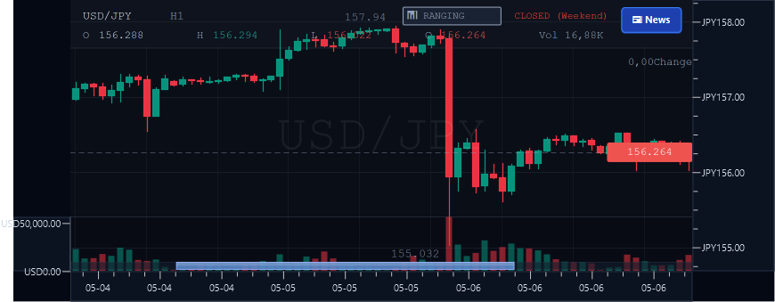
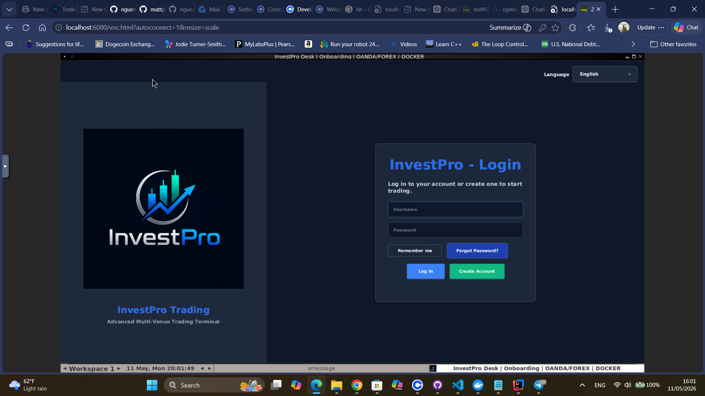

<p align="center">
  
</p>

<h1 align="center">InvestPro</h1>

Updated: 2026-10-05. [Documentation index](docs/README.md) · [Trading Desk guide](docs/trading-desk.md) · [Telegram remote desk](docs/telegram-remote-desk.md).

<p align="center">
  <strong>A modern JavaFX trading workstation for strategy research, backtesting, market intelligence, and risk-controlled automation.</strong><br/>
  Strategy Builder · Agent Runtime · Local gRPC AI Advisory · Risk Management · Backtesting · Paper Trading · Multi-Exchange Execution
</p>

<p align="center">
  Build strategies · Test ideas · Monitor markets · Control risk · Automate carefully
</p>

<p align="center">
  <a href="https://github.com/nguemechieu/investpro/actions/workflows/maven.yml">
    
  </a>
  <a href="https://github.com/nguemechieu/investpro/actions/workflows/docker-image.yml">
    
  </a>
  <a href="https://github.com/nguemechieu/investpro/actions/workflows/codecov.yaml">
    
  </a>
  <a href="https://opensource.org/licenses/Apache-2.0">
    
  </a>
  
  
  
</p>

---

## Table of Contents

- [Overview](#overview)
- [Project Status](#project-status)
- [Screenshots](#screenshots)
- [Why InvestPro?](#why-investpro)
- [Core Features](#core-features)
- [Architecture](#architecture)
- [Signal Execution Pipeline](#signal-execution-pipeline)
- [Supported Exchanges & Brokers](#supported-exchanges--brokers)
- [Stellar Workflow](#stellar-workflow)
- [Installation](#installation)
- [Running the Application](#running-the-application)
- [Docker / Browser Desktop Mode](#docker--browser-desktop-mode)
- [Configuration](#configuration)
- [Quick Start](#quick-start)
- [Strategy Development](#strategy-development)
- [User Strategy Setup](#user-strategy-setup)
- [Plugin Setup](#plugin-setup)
- [Production Readiness Checklist](#production-readiness-checklist)
- [Risk Management Philosophy](#risk-management-philosophy)
- [System Monitoring](#system-monitoring)
- [Roadmap](#roadmap)
- [Contributing](#contributing)
- [Troubleshooting](#troubleshooting)
- [Disclaimer](#disclaimer)
- [License](#license)
- [Contact](#contact)

---

## Overview

**InvestPro** is an open-source desktop trading workstation for serious traders, developers, and researchers. It combines a native JavaFX trading terminal with exchange adapters, strategy execution, agent-based automation, a local Python gRPC advisory runtime, risk controls, paper trading, and deployment support through Docker/noVNC.

The goal is to provide a complete research-to-execution environment:

1. **Research** strategies using market data and technical indicators.
2. **Backtest** and forward-test strategy behavior.
3. **Paper trade** safely before using real funds.
4. **Monitor** system health, signals, risk, and execution flow.
5. **Execute** live trades only after passing multiple safety gates.

> **Important:** InvestPro does not guarantee profits. Trading and investing involve significant financial risk. Always validate strategies in paper trading before using real capital.

---

## Project Status

> 🚧 **Active Development** — Core systems are working, but the platform is still evolving. Some modules are experimental or still being stabilized. Paper trading is recommended before any live trading.

| Area | Status |
|---|---:|
| Java 27 + JavaFX desktop workstation | ✅ Working |
| Exchange adapters | ✅ Implemented |
| Real-time WebSocket streaming | ✅ Working |
| Strategy engine + signal pipeline | ✅ Working |
| Agent runtime / SmartBot | ✅ Working |
| Paper trading | ✅ Working |
| Live trading | ⚠️ Available, use carefully |
| Risk management layer | ✅ Working |
| AI reasoning integration | ✅ Working |
| Telegram alerts / commands | ✅ Working |
| Docker + noVNC desktop deployment | ✅ Working |
| StrategyLab backtesting | ✅ Stabilized |
| Automated test suite | ✅ Improved |
| Web/mobile companion UI | 📋 Planned |

---

## Screenshots

| Trading Desk | Market Watch + Signals |
|---|---|
|  |  |

> Screenshots reflect a development build. UI and layouts may continue to change.

### Docker VNC Access

Access the full desktop from a browser:

```text
http://localhost:6080/vnc.html?autoconnect=1&resize=scale
```



---

## Why InvestPro?

Many open-source trading systems are either pure algorithmic frameworks with no serious UI, or simple single-exchange bots with limited risk control. InvestPro is designed to bridge that gap.

InvestPro provides:

- **Desktop-first trading workstation** with charts, market watch, orders, signals, and portfolio views.
- **Multi-exchange architecture** so strategies can run across different brokers and venues.
- **Strategy-first design** where trading logic is modular, testable, and replaceable.
- **Agent runtime** for symbol-level automation and system orchestration.
- **Risk-first execution** so signals are reviewed before orders reach the market.
- **Paper trading by default** to validate behavior before live execution.
- **AI-assisted reasoning** as an optional review layer, never as a direct executor.
- **Docker/noVNC deployment** for browser-based access to the desktop app.

---

## Core Features

### Market Data & Streaming

- Real-time WebSocket feeds for ticker, trades, order book depth, and candles.
- Multi-timeframe support: `1m`, `5m`, `15m`, `30m`, `1h`, `4h`, `1d`, `1w`, `1M`.
- REST fallback when WebSocket data is unavailable.
- Rate-limit handling for HTTP `429` and exchange ban/cooldown responses.
- Exchange capability probing to determine what each venue supports.

### Trading Capabilities

- Session-local paper trading with an initial USD 10,000 balance; market fills are simulated locally.
- Live trading through authenticated exchange APIs.
- Market, limit, stop-loss, take-profit, and bracket-style order support where available.
- Order lifecycle management: create, cancel, track fills, and review status.
- Small-account mode for conservative sizing.
- Symbol cooldown logic to reduce open/close thrashing.

### Symbol Tradability Controls

- InvestPro uses `UniversalTradabilityService` to normalize per-symbol permissions across exchanges and brokers.
- Market watch and research views can include symbols where `marketDataAllowed=true`.
- Bot symbol selection is restricted to `botTradingAllowed=true` symbols.
- Live order submission performs an immediate recheck requiring `orderSubmissionAllowed=true` before sending an order.
- Backtesting accepts symbols with `marketDataAllowed=true`, even when live trading is disabled for that symbol.
- Tradability metadata is surfaced in UI filters and columns so restrictions are visible before execution.

### Strategy Engine

- Pluggable `TradingStrategy` interface.
- `StrategyEngine` for running multiple strategies per symbol.
- `StrategyCatalog` for built-in strategies.
- `StrategyBootstrapper` for default strategy initialization.
- `StrategyLab` for backtesting and forward testing.
- Signal classification, filtering, scoring, and safety review.

### Agent Runtime

- `AgentRuntime` manages trading agent lifecycle.
- `AgentEventBus` decouples system components through events.
- `SymbolAgent` evaluates market state per symbol (in `symbol/` package).
- `SymbolAgentManager` controls active symbol agents.
- `PortfolioAgent` manages capital allocation and exposure (in `portfolio/` package).
- Auto-trading starts **OFF** by default and must be explicitly enabled.

### Risk Management

- `RiskManagementSystem` reviews every trade candidate.
- Configurable max risk per trade.
- Configurable max daily loss.
- Small-account mode.
- Portfolio heat / exposure checks.
- Execution gate before live orders.
- AI reasoning gate when enabled.

### AI-Assisted Analysis

- `AiReasoningService` interface for pluggable AI providers (in `ai/` package).
- `LocalAiRuntimeService` uses the local Python gRPC service for advisory trade review and backtest scoring.
- `OpenAiReasoningService` remains available as an optional fallback provider.
- `LocalAiReasoningService` remains the deterministic offline fallback.
- The Python advisory service should start alongside InvestPro so AI review is available at launch.
- `AiAuditLogger` records AI decisions for auditability.
- AI can approve, reject, or explain signals.
- Python AI recommends, Java risk gates decide, and Java execution places orders.
- AI **does not execute trades directly**.

### Charting & Technical Analysis

- Interactive candlestick charts.
- Multi-timeframe analysis.
- Rich `indicators/` package: MA, EMA, RSI, MACD, Bollinger Bands, ATR, ADX, CCI, VWAP, Ichimoku, Stochastic, OBV, Parabolic SAR, Zigzag, Fibonacci, and more.
- Indicator picker is populated from the catalog so the full supported indicator list is available from the chart UI.
- Engine-backed indicator fallbacks let catalog indicators render even when they do not have a dedicated chart class yet.
- Zoom and pan support.
- Support/resistance and annotation-ready chart structure.

### Notifications

- Telegram bot integration.
- Authorized private-chat commands for account reports, quotes, watchlists, confirmed orders and OpenAI questions; configure keys in the desktop environment.
- Email notifications through SMTP.
- Signal monitoring logs for every stage of the signal pipeline.

### Deployment

- Native JavaFX desktop app.
- Docker image with JavaFX, Xvfb, Fluxbox, x11vnc, and noVNC.
- Browser access to the desktop UI.
- PostgreSQL support for production-style deployments.
- SQLite support for local development and event logs.
- Plugin architecture via Java `ServiceLoader` SPI for extensions (exchanges, strategies, indicators, risk modules).

---

## Architecture

```text
┌─────────────────────────────────────────────────────────────────┐
│                         JavaFX UI Layer                         │
│  TradingDesk · MarketWatchPanel · ChartPanel · OrderPanel       │
└────────────────────────────┬────────────────────────────────────┘
                             │
┌────────────────────────────▼────────────────────────────────────┐
│                          SystemCore                             │
│  Application composition root — wires all major services         │
│  EventBusManager · SignalMonitorService · SystemMonitorService  │
└──────┬──────────┬──────────┬──────────┬──────────┬─────────────┘
       │          │          │          │          │
┌──────▼─────┐ ┌──▼──────┐ ┌─▼───────┐ ┌▼────────┐ ┌▼────────────┐
│ SmartBot   │ │Strategy │ │ Risk    │ │ AI      │ │ Exchange    │
│ Agent      │ │Engine   │ │ System  │ │Reasoning│ │ Adapters    │
│ Runtime    │ │         │ │         │ │         │ │             │
└──────┬─────┘ └──┬──────┘ └─┬───────┘ └┬────────┘ └┬────────────┘
       │          │          │          │           │
       └──────────▼──────────▼──────────▼───────────┘
                  TradeExecutionCoordinator
        Signal → Decision → Risk → AI Review → Execution
```

### Package Layout

```text
src/main/java/org/investpro/
├── ai/                     # AI trade review interface, OpenAI/local providers, audit logging
├── ai-service/             # Local Python gRPC advisory runtime and shared proto contract
│   ├── learning/           # Machine learning helpers
│   └── ml/                 # ML model integration
├── backtesting/            # BacktestingService, BacktestConfig, BacktestResult, simulators
├── config/                 # Application and environment configuration
├── core/                   # SystemCore, notification services, Telegram handlers
│   ├── agents/             # AgentRuntime, AgentEventBus, Agent, AgentRegistry
│   ├── bot/                # SmartBot controller
│   ├── controller/         # Application controllers
│   ├── execution/          # ExecutionEngine, TradeExecutionCoordinator
│   └── pipeline/           # TradeDecisionPipeline, risk context builders
├── credential/             # API credential management
├── data/                   # CandleData and local data helpers
├── decision/               # BotTradeDecisionEngine, signal-to-decision filters
├── dependency/             # Dependency wiring utilities
├── enums/                  # Application-wide enumerations
├── event/                  # EventBusManager, event persistence
├── exchange/               # Exchange adapters (Binance, Coinbase, OANDA, Alpaca, IB, etc.)
├── i18n/                   # Internationalization and translations
├── indicators/             # Technical indicators: MA, EMA, RSI, MACD, Bollinger, ATR, etc.
├── licensing/              # License management
├── market/                 # Market data models and services
├── models/                 # TradePair, Order, Account, Ticker, Trade
├── monitoring/             # SystemMonitorService, SignalMonitorService
├── operations/             # Operational support utilities
├── persistence/            # SQLite/PostgreSQL repositories and event log persistence
├── portfolio/              # PortfolioAgent, capital allocator, exposure and heat management
├── reasoning/              # OpenAIReasoningClient, ReasoningAgent, ReasoningDecision
├── research/               # Market research helpers
├── risk/                   # RiskManagementSystem and risk decisions
├── service/                # Domain services: OrderService, TradeService, CurrencyService, etc.
├── signal/                 # Signal, SignalAgent
├── spi/                    # Service provider interfaces for plugins
├── strategy/               # StrategyEngine, StrategyCatalog, StrategyLab, user strategies
├── symbol/                 # SymbolAgent, SymbolAgentManager, symbol state
├── trading/                # PreTradeValidation, pre-trade checklist
│   └── tradability/        # Universal symbol tradability model and filters
├── ui/                     # JavaFX windows, panels, charts, controls
└── utils/                  # Shared utility classes
```

---

## Signal Execution Pipeline

InvestPro is designed so that a raw strategy signal cannot directly place a trade. Every signal must pass through a controlled pipeline.

```text
StrategySignal
  └─→ SignalToDecisionFilter
        └─→ BotTradeDecisionEngine
              └─→ RiskManagementSystem
                    └─→ AiReasoningService optional review
                          └─→ TradeExecutionCoordinator
                                └─→ ExecutionEngine
                                      └─→ Exchange API
```

### Execution Safety Gates

| Gate | Purpose |
|---|---|
| `SignalToDecisionFilter` | Converts raw signals into reviewed trade candidates. |
| `BotTradeDecisionEngine` | Scores the trade idea and decides whether it deserves review. |
| `RiskManagementSystem` | Enforces risk limits, exposure, sizing, and daily loss controls. |
| `AiReasoningService` | Optional second review layer for reasoning and explanation. |
| `TradeExecutionCoordinator` | Coordinates final checks for reviewed strategy orders. |
| `ExecutionEngine` | Places, tracks, and manages orders. |

---

## Supported Exchanges & Brokers

| Venue | Asset Classes | WebSocket | Paper | Live |
|---|---|---:|---:|---:|
| Binance Global | Crypto spot | ✅ | ✅ | ✅ |
| Binance US | Crypto spot | ✅ | ✅ | ✅ |
| Coinbase | Crypto spot | ✅ | ✅ | ✅ |
| OANDA | Forex, CFD | ✅ | ✅ | ✅ |
| Interactive Brokers | Stocks, futures, forex, options | ✅ | ✅ | ✅ |
| Charles Schwab | US equities and brokerage accounts | ✅ | ✅ | ✅ |
| Alpaca | US stocks, crypto | ✅ | ✅ | ✅ |
| Bitfinex | Crypto | ✅ | ✅ | ✅ |
| Kraken | Crypto spot | ✅ | ✅ | ✅ |
| Stellar Network | XLM, USDC, and trustline assets on Stellar DEX | ✅ | ✅ | ✅ |
| Solona Network | On-chain wallet and network-linked assets | ✅ | ✅ | ❌ |

> This table lists adapters and intended capabilities, not completed live verification for every venue or asset class. Live trading requires valid credentials, account permissions and supported products. Test PAPER first.

---

## Stellar Workflow

InvestPro treats Stellar differently from centralized exchanges because the usable symbol universe depends on the account's balances and trustlines.

Current Stellar behavior:

- Market Watch is derived from assets with a positive balance in the connected Stellar account.
- For each held Stellar asset, InvestPro builds market watch pairs against `USDC` and `XLM` when valid.
- Bot startup prioritizes Stellar symbols tied to assets already held in the account.
- Market watch filtering keeps Stellar `USDC` and `XLM` balance pairs visible so they are not hidden by generic tradability filters.
- Trustline-aware assets can be added from the Trading Desk when Stellar is selected.

Practical implication:

- If your Stellar account holds `AQUA`, `yXLM`, or another trusted asset, the market watch will prefer pairs such as `AQUA/USDC`, `AQUA/XLM`, `yXLM/USDC`, or `yXLM/XLM` instead of showing a broad catalog-first universe.

---

## Installation

### Requirements

| Requirement | Version |
|---|---:|
| Java JDK | 27 |
| JavaFX | 27 |
| Maven | 3.8.5+ |
| Git | Recent version |
| Docker | Optional, 20+ recommended |

Recommended JDK: **JDK 27**.

Check your local environment:

```bash
java -version
mvn -version
```

Java must show version `27`.

---

## Running the Application

Set `JAVA_HOME` to JDK 27 and check `java -version` and `./mvnw -version`.
From the repository root:

```bash
./mvnw clean package
./mvnw javafx:run
```

On Windows, use `.\mvnw.cmd clean package`, then `.\mvnw.cmd javafx:run`,
or the repository's `run-app.bat`. The launcher is `org.investpro.InvestProLauncher`.
JavaFX comes from Maven; do not mix in an older JavaFX SDK. A bare application
JAR is not a standalone runtime: its JavaFX and other dependencies are required.

The installer profile invokes jpackage, but installer creation is not a verified
release path. Its current arguments use the SNAPSHOT project version; platform
version requirements must be addressed before producing an installer.

See [developer setup](DEVELOPER_GUIDE.md), [Trading Desk usage](docs/trading-desk.md),
and [release readiness](PRODUCTION_READY.md).
## Required Maven JavaFX Setup

The repository POM is authoritative. It sets `maven.compiler.release=27` and
`javafx.version=27`, configures Lombok annotation processing, generates protobuf
and gRPC sources, and uses `org.investpro.InvestProLauncher` as the main class.
The JavaFX Maven plugin version is `0.0.8`.

Import the existing Maven project instead of replacing the POM with a partial
example. A separate JavaFX SDK is unnecessary when running through Maven.
Packaging copies runtime dependencies into `target/lib`.
## Docker / Browser Desktop Mode

```bash
docker compose up -d --build
docker compose logs -f investpro-app
```

Open `http://localhost:6080/vnc.html?autoconnect=1&resize=scale`.
Root Compose starts PostgreSQL 16 and the JDK 27/JavaFX 27 desktop container.
noVNC runs inside `investpro-app`; it is not a separate service. The Python AI
service is optional and starts separately.

Use the [Docker setup guide](DOCKER_SETUP.md) for port bindings, persistent data,
development credentials and troubleshooting. Docker runtime behavior still needs
verification for the chosen deployment.
## Configuration

Use the Trading Desk credential dialog for the selected exchange. SystemCore also
loads user properties from `~/.investpro/config.properties`. AppConfig-backed keys
resolve JVM properties first, then OS environment, `.env`, and defaults; not every
subsystem uses that same reader. The following local AI keys should be set in the
Java process environment or JVM configuration, not assumed to work as dotted aliases:

```text
AI_LOCAL_GRPC_ENABLED=true
AI_LOCAL_GRPC_HOST=127.0.0.1
AI_LOCAL_GRPC_PORT=8010
AI_LOCAL_GRPC_TIMEOUT_MS=1500
```

Start Python separately using the [AI service guide](ai-service/README.md). Its
server bind keys are `AI_LOCAL_HOST` and `AI_LOCAL_PORT`, not the client keys above.

Coinbase uses `COINBASE_KEY_NAME` and `COINBASE_PRIVATE_KEY`, with the CDP key name
and matching PEM private key. Supported JSON, quoted values and escaped newlines
are normalized by credential input handling. Missing key data cannot be repaired.

For Telegram, set the Java process environment:

```text
TELEGRAM_BOT_TOKEN=<bot token>
TELEGRAM_ALLOWED_USER_IDS=<numeric user IDs, comma separated>
TELEGRAM_CHAT_ID=<notification chat ID>
OPENAI_API_KEY=<OpenAI API key>
```

Telegram also supports documented `telegram.*` user properties. Configure authorized
private-chat users before accepting remote requests; `/setapikey` does not accept
credentials. See the [full remote desk guide](docs/telegram-remote-desk.md).

Never commit real API keys, tokens, account exports or private keys. Root Compose
contains development database/VNC credentials; review them before deployment.
## Quick Start

### 1. Launch InvestPro

```bash
mvn javafx:run
```

### 2. Start With Paper Trading

1. Select an exchange, such as **Binance US**, **Coinbase**, **OANDA**, or **Stellar Network**.
2. Enable **Paper Trading** mode.
3. Confirm that a virtual balance is loaded.
4. Select a symbol from Market Watch.

If you use **Stellar Network**, first confirm the account has the trustlines and balances you expect, because the market watch list is built from those held assets.

### 3. View Live Market Data

- Select a trade pair such as `BTC/USDT`, `ETH/USD`, or `EUR/USD`.
- Confirm ticker, trades, order book, and chart updates.
- Prefer WebSocket mode for live streaming.

### 4. Place a Paper Order

- Select order side: **Buy** or **Sell**.
- Choose order type.
- Set quantity.
- Submit the order.
- Review result in orders/trades history.

### 5. Enable a Strategy

- Open the strategy panel.
- Choose a built-in strategy.
- Assign it to a symbol and timeframe.
- Review generated signals.
- Keep auto-trading disabled until the strategy has enough paper-trading history.

### 6. Monitor the System

Open the system monitor to review:

- Exchange connection status
- WebSocket health
- Market data status
- Strategy signals
- Risk decisions
- AI reasoning results
- Execution events
- Notification status

---

## Strategy Development

InvestPro is designed so users can create their own strategies.

Example strategy skeleton:

```java
package org.investpro.strategy.user;

import org.investpro.data.CandleData;
import org.investpro.strategy.StrategyContext;
import org.investpro.strategy.StrategySignal;
import org.investpro.strategy.TradingStrategy;

public class MyMomentumStrategy implements TradingStrategy {

    @Override
    public String getName() {
        return "MyMomentumStrategy";
    }

    @Override
    public StrategySignal evaluate(StrategyContext context) {
        CandleData latest = context.getLatestCandle();

        if (latest == null) {
            return StrategySignal.NEUTRAL;
        }

        double close = latest.getClose();
        double open = latest.getOpen();

        if (close > open * 1.005) {
            return StrategySignal.buySignal(context.getTradePair(), close);
        }

        if (close < open * 0.995) {
            return StrategySignal.sellSignal(context.getTradePair(), close);
        }

        return StrategySignal.NEUTRAL;
    }
}
```

Register the strategy in your strategy bootstrap or registry:

```java
StrategyRegistry.register(new MyMomentumStrategy());
```

### Strategy Requirements

A production-quality strategy should define:

- Name and version.
- Supported asset classes.
- Supported venues.
- Supported timeframes.
- Required indicators.
- Warmup candle count.
- Risk assumptions.
- Entry logic.
- Exit logic.
- Stop-loss logic.
- Take-profit logic.
- Backtest requirements.
- Paper-trading validation rules.

### Suggested Minimum Strategy Validation

Before assigning a strategy to auto-trading:

| Metric | Suggested Minimum |
|---|---:|
| Backtest trades | 100+ preferred |
| Paper trading period | 2–4 weeks minimum |
| Profit factor | 1.3+ preferred |
| Max drawdown | Must fit account risk limits |
| Win rate | Context dependent |
| Average reward/risk | Greater than 1.0 preferred |
| Live/paper slippage | Must be measured |

> A strategy with a high win rate can still lose money if average losses are larger than average wins.

---

## User Strategy Setup

Use this path to add and validate user strategies safely:

1. Read [docs/USER_STRATEGY_GUIDE.md](docs/USER_STRATEGY_GUIDE.md).
2. Start from [examples/user-strategy-simple-ema/README.md](examples/user-strategy-simple-ema/README.md).
3. Place JSON strategies/signals in `~/InvestPro/strategies/json`.
4. Place Java strategy/signal JARs in `~/InvestPro/strategies/jars`.
5. Validate in backtest and paper mode before any live promotion.

## Plugin Setup

InvestPro plugin loading uses Java `ServiceLoader` SPI. Full reference: [docs/PLUGIN_ARCHITECTURE.md](docs/PLUGIN_ARCHITECTURE.md).

1. Implement the relevant SPI under `org.investpro.spi`.
2. Register provider classes in `META-INF/services/*`.
3. Build and deploy plugin JARs to the plugin scan location.
4. Verify loaded providers in the JavaFX Plugin Manager panel.

Supported plugin categories:

- Exchange providers
- Strategy providers
- Indicator providers
- Risk module providers
- Market data providers

## Production Readiness Checklist

Before promoting to production/live usage:

1. `mvn clean test` passes.
2. Local AI gRPC advisory service starts and responds to health checks.
3. Credentials and risk limits are configured in local config.
4. Strategy promotion gates pass (validation, paper results, AI/risk review).
5. Monitoring and alerts are enabled.
6. Deployment runbook is documented for your target environment.

---

## Risk Management Philosophy

InvestPro is built around one core principle:

> **No signal should reach the market unchecked.**

The system should reject trades when:

- The account risk is too high.
- The daily loss limit is reached.
- The strategy has insufficient validation.
- The market is too volatile for the strategy.
- The spread or slippage is unacceptable.
- The venue does not support the required order type.
- The bot is in cooldown mode.
- Auto-trading is disabled.
- The AI/risk review rejects the trade.

### Risk Controls

| Control | Description |
|---|---|
| Max risk per trade | Limits capital exposed per trade. |
| Max daily loss | Stops trading after daily drawdown threshold. |
| Small-account mode | Reduces sizing for small balances. |
| Portfolio heat | Prevents too much total exposure. |
| Symbol cooldown | Prevents rapid open/close loops. |
| Strategy validation | Blocks untested strategies from live use. |
| Execution review | Verifies order type, size, venue, and risk. |

---

## System Monitoring

InvestPro includes monitoring services for operational visibility.

### SystemMonitorService

Tracks major subsystems:

1. Exchange connectivity
2. Market data
3. Account state
4. Strategy engine
5. Risk management
6. Execution engine
7. Agent runtime
8. AI reasoning
9. Notifications

### SignalMonitorService

Tracks signal lifecycle:

```text
Signal created
  → Signal filtered
  → Decision generated
  → Risk reviewed
  → AI reviewed
  → Execution approved/rejected
  → Order submitted
  → Fill/cancel/error recorded
```

### Event Logging

Important system events are persisted for review and debugging. Logs should help answer:

- What signal was generated?
- Which strategy generated it?
- Why was it approved or rejected?
- What did the risk engine decide?
- What did the AI review say?
- Was an order submitted?
- Did the exchange accept or reject the order?

---

## Roadmap

### v1.0 — Current Active Development

- [x] Java 27 + JavaFX trading workstation
- [x] Multi-exchange adapter structure
- [x] WebSocket-first market data streaming
- [x] Strategy engine
- [x] Agent runtime
- [x] Risk management system
- [x] Paper trading
- [x] AI reasoning integration
- [x] Telegram integration
- [x] Docker/noVNC deployment
- [x] StrategyLab stabilization
- [x] Auto Strategy Lab phase 1 and phase 2
- [x] User strategy builder UI
- [x] AI-assisted strategy draft workflow, disabled by default
- [x] Better automated tests
- [ ] Production installer packaging (platform validation required)

### v1.5 — Planned

- [ ] Advanced backtesting
- [ ] Walk-forward testing
- [ ] Monte Carlo testing
- [x] Strategy ranking and guarded assignment registry updates
- [ ] Portfolio-level analytics
- [ ] Sharpe, Sortino, max drawdown dashboard
- [ ] Improved execution simulator

### v2.0 — Future

- [ ] REST API server for remote control
- [ ] InvestPro.org web companion
- [ ] Cloud sync
- [ ] Multi-machine agent coordination
- [ ] Mobile companion app
- [ ] Advanced AI strategy assistant with external model execution
- [ ] Plugin marketplace for user strategies

---

## Contributing

Contributions are welcome.

### Workflow

1. Fork the repository.
2. Create a feature branch:

```bash
git checkout -b feature/your-feature-name
```

3. Make your changes.
4. Add or update tests.
5. Run the build:

```bash
mvn clean package
```

6. Open a pull request with a clear description.

### Code Standards

- Java 27.
- Maven build.
- JavaFX UI conventions.
- SLF4J/Logback for logging.
- No `System.out.println` in production code.
- JetBrains `@NotNull` / `@Nullable` annotations where useful.
- Null-safe code.
- Clear error handling.
- Tests for important business logic.

### Good Pull Requests Include

- What changed.
- Why it changed.
- How it was tested.
- Screenshots for UI changes.
- Logs for runtime fixes.
- Migration notes if configuration changed.

---

## Troubleshooting

### Error: JavaFX runtime components are missing

This usually happens when running the app with plain `java -jar` without JavaFX modules.

Use this during development:

```bash
mvn clean javafx:run
```

Or run manually with JavaFX modules:

```bash
java \
  --module-path /path/to/javafx-sdk-27/lib \
  --add-modules javafx.controls,javafx.fxml,javafx.graphics,javafx.web,javafx.swing \
  -jar target/investpro-1.0.0-SNAPSHOT.jar
```

### Unsupported class version error

Your Java version is too old.

```bash
java -version
```

Install Java 27 or newer.

### Maven cannot find JavaFX plugin

Make sure your `pom.xml` contains:

```xml
<plugin>
    <groupId>org.openjfx</groupId>
    <artifactId>javafx-maven-plugin</artifactId>
    <version>0.0.8</version>
</plugin>
```

Then run:

```bash
mvn clean javafx:run
```

### JavaFX display error on Linux

Check your display environment:

```bash
echo $DISPLAY
```

For local Linux desktop usage, you may need:

```bash
export DISPLAY=:0
```

For Docker, use the provided noVNC setup instead of trying to attach directly to the host display.

### Docker VNC screen is blank

Try:

```bash
docker-compose logs -f
```

Check that these services started correctly:

- Xvfb
- Fluxbox
- x11vnc
- noVNC / websockify
- Java application

### WebSocket disconnects

- Reconnection should happen automatically.
- Check exchange rate limits.
- Verify firewall and network access.
- Prefer WebSocket streaming over REST polling.
- Check logs in `~/.investpro/logs/`.

### HTTP 429 / 418 rate limits

- Reduce REST polling frequency.
- Use WebSocket market data.
- Allow cooldown logic to recover.
- Avoid polling trades/order book too aggressively.

### Authentication fails

Verify:

- API key is correct.
- API secret is correct.
- Account ID is correct.
- Required API permissions are enabled.
- IP allowlist settings are correct.
- Environment/config file is being loaded.
- Clock/time synchronization is correct.

### High latency

Open system monitoring and review network latency. For live trading, consider:

- Wired connection.
- VPS closer to exchange region.
- WebSocket instead of REST polling.
- Fewer symbols per session.

---

## Security Notes

- Never commit API keys.
- Never commit `.env` files with secrets.
- Use paper trading by default.
- Use read-only API keys when testing market data.
- Use separate keys for development and production.
- Limit withdrawal permissions on exchange keys.
- Rotate keys if exposed.

---

## Disclaimer

> **Important — Read Before Using**

InvestPro is provided as-is for educational, research, and development purposes.

- Trading and investing carry significant financial risk.
- You can lose some or all of your capital.
- Past performance does not guarantee future results.
- Backtested results do not guarantee live profitability.
- Paper trading results do not guarantee live profitability.
- This software does not provide financial advice.
- AI-generated analysis may be wrong.
- Exchange APIs may fail, delay, reject, or incorrectly process requests.
- Always test thoroughly before using real money.
- Use only capital you can afford to lose.
- Consult a qualified financial advisor before making investment decisions.

The author and contributors are not responsible for financial losses, missed opportunities, software bugs, exchange outages, API failures, configuration mistakes, or any other outcome caused by using this software.

---

## License

Licensed under the [Apache License 2.0](LICENSE).

```text
Copyright 2022–2026 Noel Martial Nguemechieu

Licensed under the Apache License, Version 2.0 (the "License");
you may not use this file except in compliance with the License.
You may obtain a copy of the License at

    http://www.apache.org/licenses/LICENSE-2.0
```

---

## Contact

| Channel | Link |
|---|---|
| GitHub Issues | [Report bugs and request features](https://github.com/nguemechieu/investpro/issues) |
| GitHub Discussions | [Ask questions and share ideas](https://github.com/nguemechieu/investpro/discussions) |
| Email | nguemechieu@live.com |

**Author:** Noel Martial Nguemechieu  
**Repository:** [https://github.com/nguemechieu/investpro](https://github.com/nguemechieu/investpro)  
**First commit:** December 2022

---

<p align="center">
  <sub>Built with Java 27 · JavaFX 27 · Apache Maven · Open source under Apache 2.0</sub>
</p>
