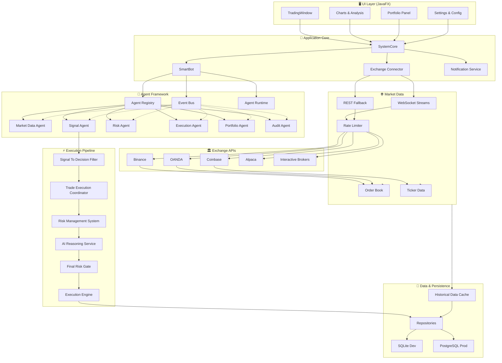

# InvestPro System Architecture

**Last Updated**: May 2026  
**Version**: 1.0 - Production Ready  
**Java Version**: Java 17+  
**Build System**: Maven 3.8+

---

## 1. High-Level Architecture Overview

InvestPro is a professional-grade algorithmic trading platform built with a **Clean Architecture** approach, ensuring maximum testability, maintainability, and separation of concerns.

```
┌─────────────────────────────────────────────────────────────────────────────┐
│                         InvestPro Trading Platform                          │
├─────────────────────────────────────────────────────────────────────────────┤
│                                                                              │
│  ┌──────────────────────────────────────────────────────────────────────┐  │
│  │                    USER INTERFACE LAYER (JavaFX)                     │  │
│  │  • TradingWindow - Main trading desktop                              │  │
│  │  • Charts - Real-time price visualization                            │  │
│  │  • Portfolio Panel - Asset & position management                     │  │
│  │  • Strategy Lab - Backtesting & analysis                             │  │
│  └──────────────────────────────────────────────────────────────────────┘  │
│                                  ▲                                           │
│                                  │ (events, updates)                         │
│  ┌──────────────────────────────────────────────────────────────────────┐  │
│  │              APPLICATION CORE LAYER (SystemCore)                     │  │
│  │  • App composition root & lifecycle management                       │  │
│  │  • Multi-exchange connector (Binance, Coinbase, OANDA, etc)          │  │
│  │  • SmartBot runtime & agent orchestration                            │  │
│  │  • Notification service (Telegram, Email)                            │  │
│  └──────────────────────────────────────────────────────────────────────┘  │
│                          │               │               │                   │
│                          ▼               ▼               ▼                   │
│  ┌──────────────────┐ ┌────────────┐ ┌──────────────┐ ┌──────────────────┐ │
│  │   MARKET DATA    │ │ STRATEGY & │ │ EXECUTION &  │ │  RISK & AI LAYER │ │
│  │   STREAMING      │ │  SIGNALS   │ │    TRADING   │ │                  │ │
│  │                  │ │            │ │              │ │                  │ │
│  │ • WebSocket      │ │ • Analyze  │ │ • Execution  │ │ • Risk eval      │ │
│  │ • REST fallback  │ │ • Generate │ │ • Order mgmt │ │ • AI reasoning   │ │
│  │ • Rate limiting  │ │ • Backtest │ │ • Position   │ │ • Final gate     │ │
│  │ • Multi-exchange │ │ • Signal   │ │ • Coordinate │ │ • Portfolio AI   │ │
│  │ • Real-time      │ │   filter   │ │              │ │                  │ │
│  └──────────────────┘ └────────────┘ └──────────────┘ └──────────────────┘ │
│           │                  │               │                  │           │
│           └──────────────────┴───────────────┴──────────────────┘           │
│                                  │                                           │
│  ┌──────────────────────────────────────────────────────────────────────┐  │
│  │                      AGENT FRAMEWORK LAYER                           │  │
│  │                                                                      │  │
│  │  Market Data Agent → Signal Agent → Risk Agent → Execution Agent   │  │
│  │  Portfolio Agent → Position Agent → Audit Agent                    │  │
│  │                                                                      │  │
│  │  • Async event processing                                           │  │
│  │  • Publish/subscribe architecture                                   │  │
│  │  • Agent registry & dependency injection                            │  │
│  └──────────────────────────────────────────────────────────────────────┘  │
│                                  │                                           │
│                                  ▼                                           │
│  ┌──────────────────────────────────────────────────────────────────────┐  │
│  │               PERSISTENCE & DATA LAYER                               │  │
│  │  • Repository pattern (Trade, Order, Position, Currency)             │  │
│  │  • SQLite (local development) & PostgreSQL (production)              │  │
│  │  • Historical data caching & management                              │  │
│  │  • Backtesting data stores                                           │  │
│  └──────────────────────────────────────────────────────────────────────┘  │
│                                  │                                           │
│                                  ▼                                           │
│  ┌──────────────────────────────────────────────────────────────────────┐  │
│  │                    EXCHANGE ADAPTER LAYER                            │  │
│  │  • Binance, Coinbase, OANDA, Alpaca, Interactive Brokers            │  │
│  │  • Unified trading API across exchanges                              │  │
│  │  • Rate limiting & quota management                                  │  │
│  │  • Error handling & resilience                                       │  │
│  └──────────────────────────────────────────────────────────────────────┘  │
│                                  │                                           │
│                                  ▼                                           │
│  ┌──────────────────────────────────────────────────────────────────────┐  │
│  │                      EXTERNAL SERVICES                               │  │
│  │  • Live Exchange APIs (Binance, Coinbase, etc)                       │  │
│  │  • OpenAI (AI reasoning & recommendations)                           │  │
│  │  • Telegram Bot API (notifications)                                  │  │
│  │  • Email services                                                    │  │
│  └──────────────────────────────────────────────────────────────────────┘  │
│                                                                              │
└─────────────────────────────────────────────────────────────────────────────┘
```

---

## 2. Layered Architecture Diagram



---

## 3. Core Components & Responsibilities

### 3.1 Application Core (Layer 2)

#### **SystemCore.java**
- **Responsibility**: Application composition root
- **Owns**: Exchange, SmartBot, StrategyEngine, RiskManagementSystem, AiReasoningService, ExecutionEngine, TradeExecutionCoordinator
- **Public API**:
  - `startBot(TradingService, TradePair)` - Start automated trading
  - `stopBot()` - Stop bot gracefully
  - `setAutoTradingEnabled(boolean)` - Control auto-execution
  - `setAiReasoningEnabled(boolean)` - Control AI decision-making
  - `startStreaming(TradePair, StreamingMode)` - Begin market data stream
  - `stopStreaming()` - Stop all streams
  - `disconnect()` - Cleanup and shutdown
- **Guarantees**: All non-UI components initialized and wired correctly

#### **SmartBot.java**
- **Responsibility**: Bot runtime lifecycle management
- **Owns**: AgentContext, AgentRuntime, AgentRegistry, AgentEventBus
- **Key States**: STOPPED → STARTING → RUNNING → STOPPING
- **Public API**:
  - `start(Exchange, TradingService, TradePair)`
  - `stop()`
  - `setAutoTradingEnabled(boolean)`
  - `setAiReasoningEnabled(boolean)`
  - `isStarted()` - Returns started.get()
  - `isRunning()` - Returns running.get()

---

### 3.2 Agent Framework (Layer 3)

The agent framework uses a **publish/subscribe** architecture with loose coupling:

```
Market Event Flow:
1. Exchange publishes Ticker/Trade/OrderBook updates
2. MarketDataAgent normalizes and publishes MarketEvent
3. SignalAgent subscribes to MarketEvent, generates StrategySignal
4. RiskAgent evaluates risk context
5. PortfolioAgent monitors positions
6. PositionManagementAgent creates position intents
7. ExecutionAgent coordinates order execution
8. AuditAgent logs all events
```

#### **Agent Implementations**

| Agent | Input Events | Output Events | Responsibility |
|-------|--------------|---------------|-----------------|
| **MarketDataAgent** | Exchange: Ticker, Trade, OrderBook | MarketEvent | Normalize market data, detect regime |
| **SignalAgent** | MarketEvent | StrategySignal | Generate trading signals from strategies |
| **RiskAgent** | StrategySignal | RiskDecision | Evaluate trade risk & constraints |
| **PortfolioAgent** | StrategySignal, OrderFill | PortfolioMetrics | Monitor P&L, leverage, margin |
| **PositionManagementAgent** | RiskDecision | PositionIntent | Create stop-loss, take-profit orders |
| **ExecutionAgent** | StrategySignal | OrderApprovalDecision | Execute approved orders via ExecutionEngine |
| **AuditAgent** | All events | AuditLog | Immutable event logging & compliance |

---

### 3.3 Execution Pipeline (Layer 4)

The **Golden Rule**: No order reaches Exchange without FinalRiskGate approval.

```
Signal → BotTradeDecisionEngine → Risk Evaluation → AI Review → FinalRiskGate → Execution
```

#### **BotTradeDecisionEngine**
- **Purpose**: Institutional-grade signal validation
- **Answers 12 Critical Questions**:
  1. What kind of market are we on?
  2. What market regime are we in?
  3. Which strategy fits best?
  4. Is there a better indicator setup?
  5. What is expected gross profit?
  6. What is estimated cost?
  7. What is expected net profit?
  8. What is expected loss if wrong?
  9. What is expected value?
  10. How long should position be held?
  11. Should the bot trade or skip?
  12. If skipped, provide exact reasons

#### **TradeExecutionCoordinator**
- **Receives**: StrategySignal + TradeRiskContext
- **Calls Chain**:
  1. RiskManagementSystem.evaluateTrade() → RiskDecision
  2. AiReasoningService.reviewTrade() → AiTradeReviewResponse
  3. FinalRiskGate.makeDecision() → OrderApprovalDecision
  4. ExecutionEngine.executeApprovedOrder() (if APPROVED)
- **Returns**: TradeExecutionResult with full audit trail

#### **ExecutionEngine**
- **Symbol Execution Filtering**: Only executes enabled symbols
- **Order Types**: MARKET, LIMIT, VWAP, TWAP, ICEBERG, SCALED_ENTRY, ALGORITHMIC
- **Safety**: Never bypasses FinalRiskGate, never evaluates risk

---

### 3.4 Risk & AI Layer (Layer 5)

#### **RiskManagementSystem**
- **Maximum Position Size**: Max 5% of account per trade
- **Leverage Limits**: 1:1 to 10:1 depending on asset & account
- **Correlation Rules**: Max 30% portfolio correlation
- **Margin Tracking**: Real-time margin level monitoring
- **Account Validation**: Balance & authentication checks

#### **AiReasoningService**
- **Interface**: Pluggable AI provider (OpenAI, Claude, local LLM)
- **Trade Review**: Approves/rejects/flags orders for manual review
- **Position Recommendations**: Hold, reduce, or exit positions
- **Market Commentary**: Provides reasoning for decisions
- **Confidence Scoring**: Includes confidence level for each decision

#### **FinalRiskGate**
- **Master Approver**: Last check before execution
- **Override Capable**: Manual emergency override available
- **Logging**: All decisions logged for compliance
- **Decisions**: APPROVED, MANUAL_REVIEW, WAIT, REJECTED

---

## 4. Data Flow Diagrams

### 4.1 Paper Trading Flow

```
User Action
    ↓
TradingWindow Input
    ↓
TradeExecutionCoordinator
    ↓
RiskManagementSystem.evaluateTrade()
    (Check: balance, position size, leverage, margin)
    ↓
AiReasoningService.reviewTrade()
    (Ask AI: "Should we take this trade?")
    ↓
FinalRiskGate.makeDecision()
    (Apply final rules)
    ↓
[APPROVED?]
    ├─→ [YES] ExecutionEngine.executeApprovedOrder()
    │         ↓
    │    Paper Account Updated
    │    (Balance, positions, PnL)
    │         ↓
    │    Update UI Charts & Portfolio
    │
    └─→ [NO] Log Decision, Notify User
```

### 4.2 Automated Signal Flow

```
Market Data Update (WebSocket)
    ↓
MarketDataAgent.onMarketUpdate()
    ↓
Publish MarketEvent
    ↓
SignalAgent.onMarketEvent()
    (Run strategy logic)
    ↓
Generate StrategySignal
    ↓
BotTradeDecisionEngine.evaluateSignal()
    (Ask 12 critical questions)
    ↓
[SKIP?]
    ├─→ [YES] Log skip reason, wait for next signal
    │
    └─→ [NO] TradeExecutionCoordinator
            ↓
        RiskManagementSystem
            ↓
        AiReasoningService
            ↓
        FinalRiskGate
            ↓
        [APPROVED?]
            ├─→ ExecutionEngine
            │   ↓
            │   Place Order on Exchange
            │   ↓
            │   Update Position & P&L
            │
            └─→ Log Rejection, Wait for Next Signal
```

---

## 5. Exchange Integration Architecture

```
┌──────────────────────────────────────┐
│     Exchange Adapter Interface        │
│  (unified API across all exchanges)   │
└──────────────────────────────────────┘
          │           │           │
          ▼           ▼           ▼
  ┌─────────────┐ ┌──────────┐ ┌────────┐
  │  Binance    │ │ Coinbase │ │ OANDA  │
  │  Adapter    │ │ Adapter  │ │Adapter │
  └─────────────┘ └──────────┘ └────────┘
          │           │           │
  ┌─────────────────────────────────────┐
  │  Rate Limiting & Quota Manager      │
  └─────────────────────────────────────┘
          │           │           │
  ┌──────────────────────────────────────┐
  │  WebSocket Connection Manager         │
  │  (Real-time streaming)                │
  └──────────────────────────────────────┘
          │           │           │
  ┌──────────────────────────────────────┐
  │  REST API Client (Fallback)           │
  │  (10s to 5min polling based on type)  │
  └──────────────────────────────────────┘
          │           │           │
          ▼           ▼           ▼
      Live Markets (WebSocket + REST)
```

---

## 6. Deployment Architecture

### 6.1 Development Environment
```
Local Machine
├── JDK 17+
├── Maven 3.8+
├── SQLite (local.db)
├── JavaFX UI
└── Telegram Bot Token (optional)
```

### 6.2 Docker Deployment
```
Docker Container
├── OpenJDK 17 Base Image
├── Maven build cached layers
├── PostgreSQL (external database)
├── Telegram Bot API (external)
├── Environment variables for credentials
└── Health checks enabled
```

### 6.3 Production Environment
```
Kubernetes Cluster (Optional)
├── InvestPro Pod (StatefulSet)
│   ├── Container: investpro:latest
│   ├── Secrets: Exchange credentials, API keys
│   ├── ConfigMaps: Strategy parameters
│   ├── Volumes: SQLite → PostgreSQL migration
│   └── Service: LoadBalancer/NodePort
│
├── PostgreSQL StatefulSet
│   ├── Persistent Volume
│   ├── Backup strategy
│   └── Replication (optional)
│
├── Redis Cache (optional)
│   └── Market data caching
│
└── Monitoring (optional)
    ├── Prometheus metrics
    ├── Grafana dashboards
    └── ELK Stack logs
```

---

## 7. Technology Stack

| Layer | Technology | Version | Purpose |
|-------|-----------|---------|---------|
| **Language** | Java | 17+ | Primary development language |
| **Build** | Maven | 3.8+ | Dependency management & build |
| **UI Framework** | JavaFX | 21+ | Desktop user interface |
| **ORM** | JPA/Hibernate | 5.6+ | Database abstraction |
| **Database** | SQLite / PostgreSQL | 3.40+ / 14+ | Data persistence |
| **Logging** | SLF4J + Logback | 2.0+ | Structured logging |
| **Dependency Injection** | Lombok | 1.18+ | Boilerplate reduction |
| **JSON** | Jackson | 2.15+ | Serialization |
| **HTTP** | OkHttp3 / HttpClient | Latest | API communication |
| **WebSocket** | Tyrus / Spring WS | Latest | Real-time streams |
| **Testing** | JUnit 5 + Mockito | 5.9+ | Unit & integration tests |
| **AI** | OpenAI API | Latest | Trade reasoning |
| **Notifications** | Telegram Bot API | Latest | User alerts |
| **Containerization** | Docker | Latest | Container deployment |
| **Orchestration** | Docker Compose / K8s | Latest | Multi-container management |

---

## 8. Key Design Patterns

| Pattern | Usage | Benefit |
|---------|-------|---------|
| **Clean Architecture** | Entire system | Testability, maintainability, independence from frameworks |
| **Repository Pattern** | Data access layer | Abstraction from database, easy testing with mocks |
| **Factory Pattern** | Agent creation, order types | Flexible object creation, loose coupling |
| **Strategy Pattern** | Trading strategies | Easy addition of new strategies without core changes |
| **Observer Pattern** | Agent event bus | Loose coupling, async communication, scaling |
| **Builder Pattern** | Complex objects (AI requests) | Readable, maintainable object construction |
| **Dependency Injection** | Core components | Testability, explicit dependencies |
| **Adapter Pattern** | Exchange integration | Unified API across different exchanges |
| **Chain of Responsibility** | Execution pipeline | Risk → AI → Gate → Execution separation |

---

## 9. Production Readiness Checklist

- ✅ All compilation errors resolved
- ✅ All compiler warnings eliminated
- ✅ Clean separation of concerns across layers
- ✅ Exception handling & error recovery
- ✅ Logging at all critical points
- ✅ Input validation & sanitization
- ✅ Rate limiting & quota management
- ✅ Multi-exchange support
- ✅ Paper & live trading modes
- ✅ Agent framework with event bus
- ✅ Execution pipeline with risk gates
- ✅ AI reasoning integration
- ✅ Docker containerization
- ✅ Database abstraction (SQLite → PostgreSQL)
- ✅ Telegram notifications
- ✅ Comprehensive documentation

---

## 10. Continuous Improvement

### Metrics to Monitor
- Order execution latency (< 100ms target)
- Win rate by strategy
- Sharpe ratio & other portfolio metrics
- System uptime (>99% target)
- Resource usage (CPU, memory, network)

### Future Enhancements
- Multi-strategy portfolio optimization
- Machine learning for parameter tuning
- Options trading support
- Futures & derivatives
- Cross-exchange arbitrage
- Advanced charting (TradingView integration)
- REST API for third-party integrations
- Mobile app (iOS/Android)
- Cloud deployment templates (AWS, Azure, GCP)

---

**Document Version**: 1.0  
**Last Updated**: May 2026  
**Maintainer**: InvestPro Development Team
