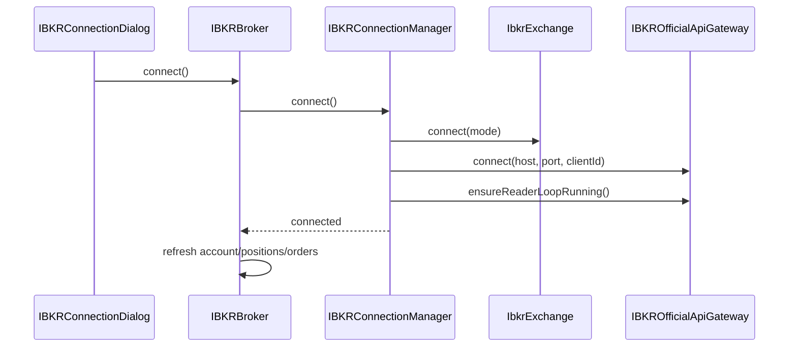
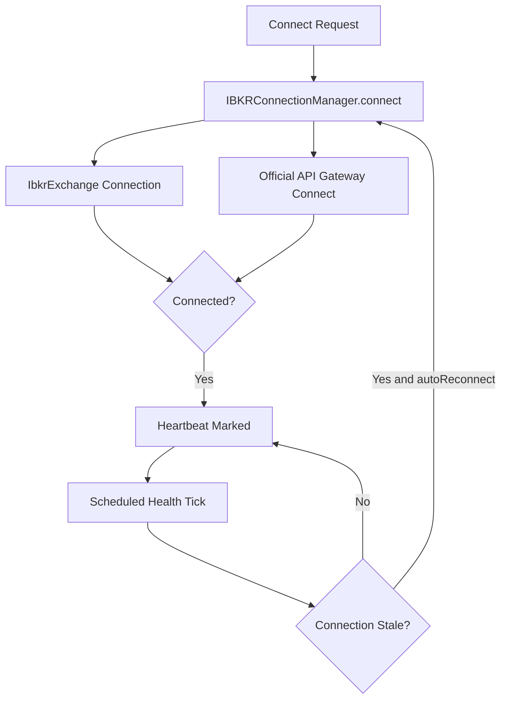
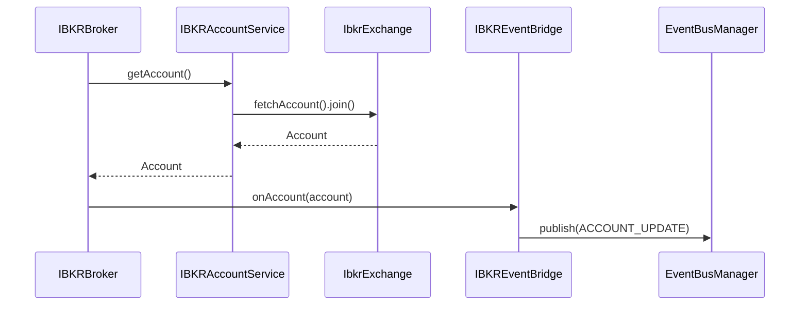
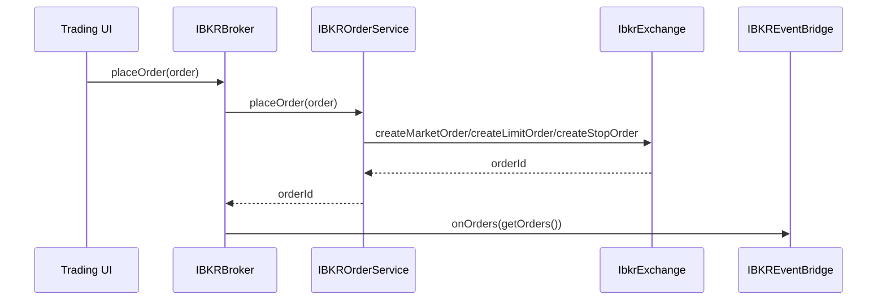
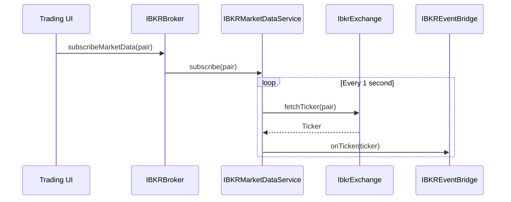

# IBKR Professional Architecture Flows

This document describes the production-oriented IBKR architecture that now exists in InvestPro under `org.investpro.broker.ibkr`.

## Components

- `IBKRBroker`: orchestrator implementing broker-level workflow.
- `IBKRConnectionManager`: session lifecycle, heartbeat, and auto-reconnect loop.
- `IBKRAccountService`: account retrieval bridge.
- `IBKRPositionService`: position retrieval bridge.
- `IBKROrderService`: order mapping and execution bridge.
- `IBKRMarketDataService`: streaming adapter for ticker updates.
- `IBKRContractService`: contract normalization and mapping.
- `IBKREventBridge`: JavaFX `ObservableList` and EventBus callback fanout.
- `IBKROfficialApiGateway`: integration point for official `EClientSocket`, `EWrapper`, and `EReader` callback model.

## Connection Flow

## Login and Session Health Flow

## Account Synchronization Flow

## Order Execution Flow

## Market Data Flow

