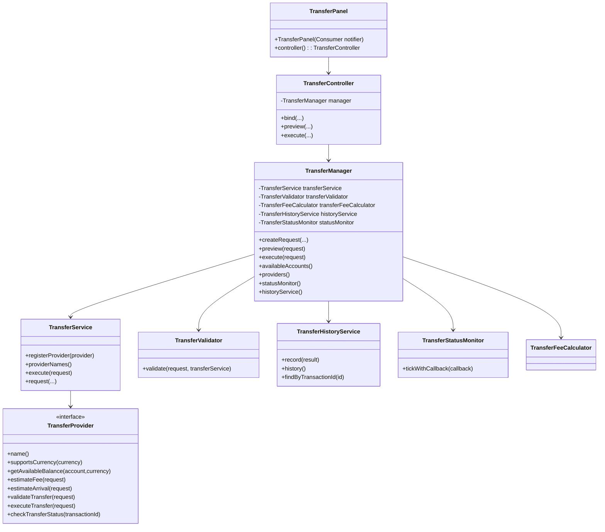
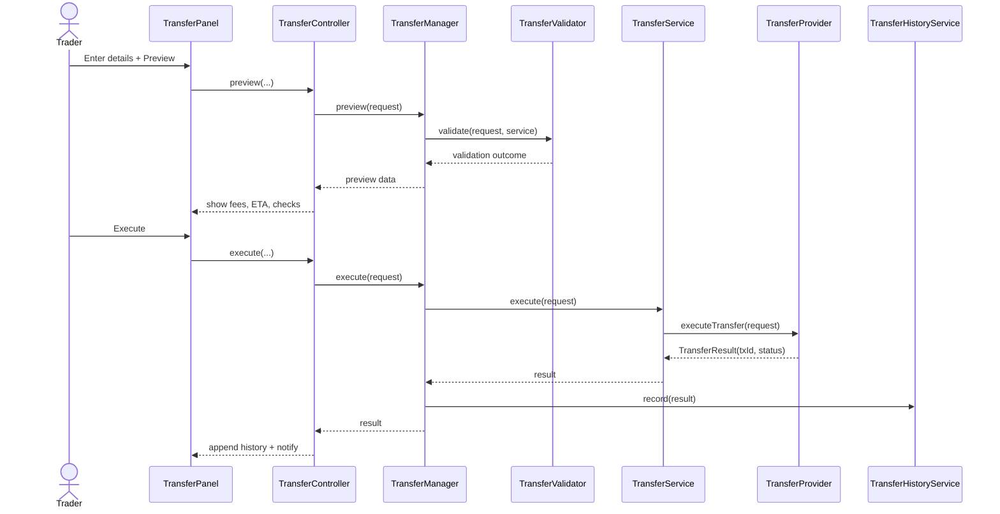

# Transfer Funds Architecture

## Overview

The transfer subsystem provides a broker-agnostic, auditable workflow for moving funds between internal accounts, external brokers, and wallet rails. It is implemented in `org.investpro.transfer` and exposed through the `Accounts -> Transfer Funds` flow in the JavaFX desktop shell.

Core objectives:
- Strong pre-flight validation before execution.
- Preview-first UX with explicit operator confirmation.
- Status lifecycle tracking and local history retention.
- Provider plug-in point for venue-specific transfer behavior.

## Package Structure

- `TransferProvider`: abstraction for each venue/provider implementation.
- `TransferService`: runtime provider registry and execution orchestrator.
- `TransferValidator`: policy/limits/currency/network/KYC gatekeeper.
- `TransferFeeCalculator`: fee/ETA model for preview mode.
- `TransferManager`: facade over validator, fee calculator, service, history, and monitor.
- `TransferController`: JavaFX interaction/controller logic.
- `TransferPanel`: Bloomberg-style panel UI with preview, execute, and history.
- `TransferHistoryService`: local transfer ledger + retrieval APIs.
- `TransferStatusMonitor`: lifecycle progression callback loop.
- `TransferRequest` / `TransferResult` / `TransferStatus`: transfer domain model.

## Class Diagram



## Transfer Workflow

```mermaid
flowchart TD
    A[User opens Accounts -> Transfer Funds] --> B[Fill transfer form]
    B --> C[Preview]
    C --> D[TransferController builds TransferRequest]
    D --> E[TransferManager.preview(request)]
    E --> F[TransferValidator.validate]
    F -->|fail| G[Show validation error]
    F -->|pass| H[Fee + ETA estimation]
    H --> I[Preview summary rendered]
    I --> J[Operator confirms Execute]
    J --> K[TransferManager.execute(request)]
    K --> L[Provider executeTransfer]
    L --> M[TransferResult stored in history]
    M --> N[Status monitor polling/callback]
    N --> O[UI status refresh + notifications]
```

## Sequence Diagram



## Production Implementation Strategy

1. Provider hardening
- Implement concrete `TransferProvider` adapters for IBKR, Coinbase, and internal treasury.
- Enforce provider capability metadata (currencies, min/max, rails, cut-off windows).
- Add structured error mapping to normalize provider-specific failures.

2. Risk and policy controls
- Introduce configurable transfer policy profiles by account tier and jurisdiction.
- Add dual-approval checkpoints for high-value transfers.
- Add idempotency key support and replay protection.

3. Persistence and audit
- Persist history/events in SQL with immutable audit events.
- Emit transfer lifecycle events to monitoring and notification pipelines.
- Add reconciliation jobs against provider settlement reports.

4. UX and operator controls
- Extend `Deposits & Withdrawals` with live ledger integration.
- Add advanced filtering, export, and drill-through into transfer details.
- Add SLA badges and escalation alerts for stuck transfers.

5. Testing and reliability
- Add unit tests for validator rules, preview calculations, and status transitions.
- Add contract tests per provider adapter with sandbox accounts.
- Add chaos/failure simulations for timeout, rejected, and partial transfer paths.

6. Security and compliance
- Tokenize sensitive account identifiers in logs.
- Enforce KYC/AML gates and country/network restrictions.
- Add role-based action control for preview, execute, and approve actions.
